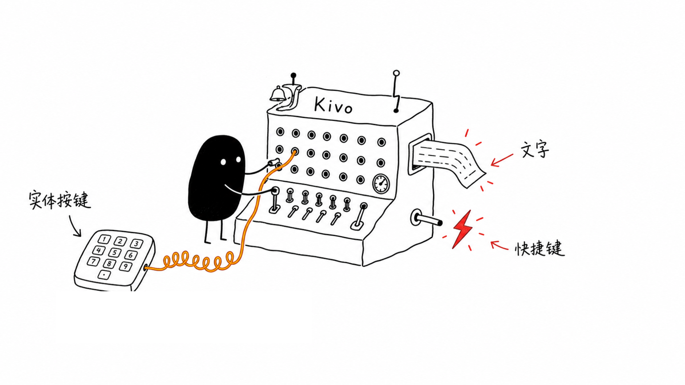
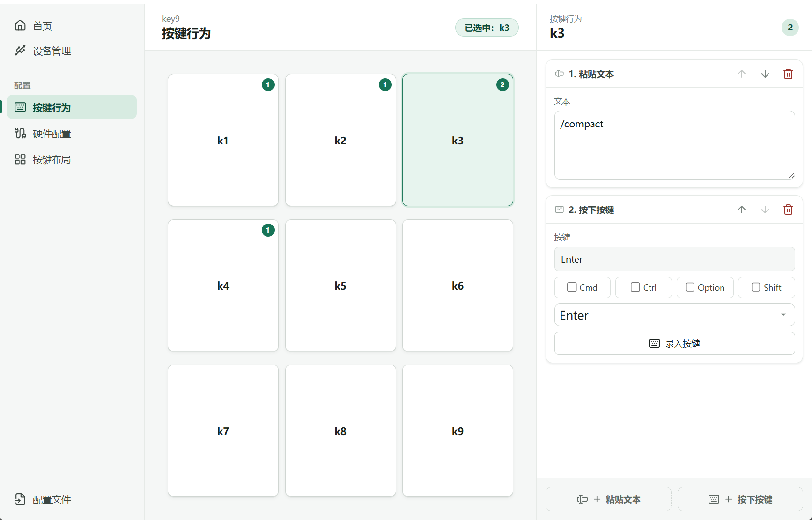
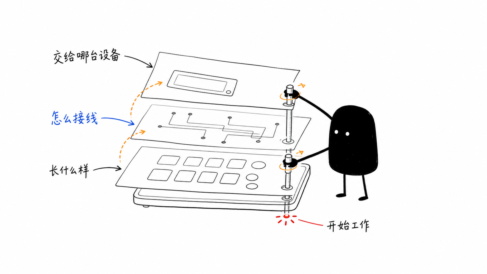
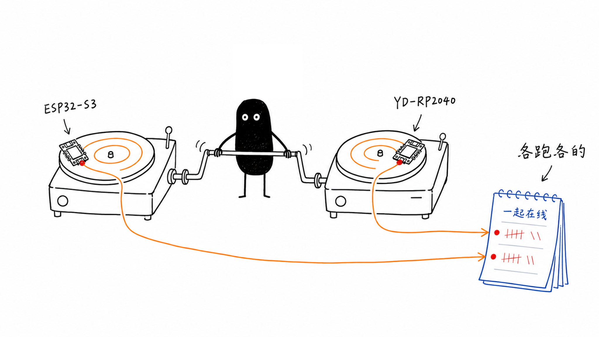

# Kivo

把实体按键变成电脑里的文字与快捷键。

[下载最新版本](https://github.com/leowzz/kivo/releases/latest) · [快速上手](#快速上手) · [本地开发](#本地开发)



Kivo 是一套由设备固件和 Tauri 桌面 helper 组成的实体按键工作台。它识别每一台控制器，为设备分配对应的按键布局与接线配置，再把按下动作转换成文字粘贴或快捷键。

## 能做什么

- **执行桌面动作**：一个按键可以依次执行文字粘贴和快捷键动作。
- **学习实体接线**：支持独立 GPIO 按键与触点矩阵，并可通过指定设备进行按键学习。
- **管理多台设备**：每台设备保留独立的 Runtime Assignment，切换编辑中的配置不会改动其他设备。
- **复用设备配置**：一个 Device Profile 可以包含多个 Hardware Profile，适配不同板卡或接线版本。
- **观察实际使用**：首页展示累计次数、今日次数、活跃按键、七日热力图和最近活动。
- **迁移与恢复**：支持单个设备配置导入导出，以及包含设备分配和统计数据的完整备份恢复。



## 快速上手

1. 从 [Releases](https://github.com/leowzz/kivo/releases/latest) 下载 macOS 安装包或 Windows x64 安装程序。
2. 连接已经刷入 Kivo 固件的受支持控制器。通过身份与协议校验后，Kivo 会自动登记这台设备。
3. 新建 Device Profile，或从已有配置复制/导入。Device Profile 决定可见按键布局与动作。
4. 为目标板卡创建 Hardware Profile，通过手动配置或学习模式把实体输入映射到按键。
5. 在“按键行为”中配置文字粘贴或快捷键，然后在“设备管理”中保存 Runtime Assignment。
6. 按下实体按键，在首页确认动作、计数和活动记录。

新登记的设备在获得有效 Runtime Assignment 前不会执行动作。编辑中的 Device Profile 也不会自动替换任何设备正在使用的配置。

## 配置怎样组合



| 概念 | 负责什么 |
|---|---|
| Device Profile | 可见布局、按键定义、动作，以及一个或多个 Hardware Profile |
| Hardware Profile | 面向具体板卡的接线拓扑、输入绑定和去抖设置 |
| Device | 一台有稳定硬件序列号的实体控制器；USB 端口不是设备身份 |
| Runtime Assignment | 把一个 Device Profile 和兼容的 Hardware Profile 分配给一台 Device |
| Editor Profile | 当前正在界面中编辑的 Device Profile，不影响其他设备运行 |

## 支持的控制器

| 板卡 | Controller Family | 运行时 USB | 固件环境 | 上传命令 |
|---|---|---|---|---|
| LuatOS ESP32-S3-AIO | ESP32-S3 | `303a:4002` | `esp32s3` | `make upload-esp32s3` |
| VCC-GND YD-RP2040 | RP2040 | `2e8a:102e` | `rp2040` | `make upload-rp2040` |

YD-RP2040 的 UF2 bootloader USB 标识为 `2e8a:0003`。Kivo 会先校验 USB 身份，再通过 `HELLO` 协议确认板卡和固件；不受该 Board Profile 支持的 GPIO 会被拒绝。

YD-RP2040 的 Hardware Profile 还可以启用固定为 `128x32`、地址为 `0x3C` 的 SSD1306 OLED，并分别选择 SDA 与 SCL 引脚。OLED 占用的两个 GPIO 不会再出现在按键输入或学习模式中；运行时配置成功后屏幕才会开始显示状态。



两种控制器共享按键扫描、去抖、协议和运行状态机，各自只保留很薄的 USB/HID 平台适配。多台 ESP32-S3 与 YD-RP2040 可以同时在线，每台设备继续使用自己的 Runtime Assignment。

## 本地开发

需要：

- Node.js `24.18.0` 与 npm `11.16.0`
- Rust stable 和 Tauri 2 所需的系统构建依赖
- Python `3.13`、[`uv`](https://docs.astral.sh/uv/) 与 PlatformIO
- macOS 或 Windows；发行工作流构建 macOS universal DMG 和 Windows x64 NSIS 安装程序

```bash
git clone https://github.com/leowzz/kivo.git
cd kivo

nvm install
nvm use
uv sync
npm ci
make helper
```

仓库的 `.envrc` 会加载 `.nvmrc` 中的精确 Node 版本。使用 direnv 时可以验证实际解析到的工具：

```bash
direnv allow
direnv exec . node --version
direnv exec . npm --version
```

预期分别输出 `v24.18.0` 和 `11.16.0`。

## 固件

分别构建两个固件目标：

```bash
make build-esp32s3
make build-rp2040
```

分别上传；不要使用泛化的 `make upload`：

```bash
make upload-esp32s3
make upload-rp2040
```

当同时连接多块同型号板卡时，用稳定硬件序列号指定目标：

```bash
make upload-esp32s3 SERIAL=ABCDEF123456
make upload-rp2040 SERIAL=E0C9125B0D9B
```

## 测试与构建

```bash
make test
make helper-build
```

`make test` 会运行发布脚本测试、Python 上传/选择测试、PlatformIO native 测试、Rust 测试与 Clippy、前端测试和生产构建。`make helper-build` 在本机构建 Tauri 应用包。

## 项目结构

```text
src/                 React 配置界面与共享固件入口
src/platform/        ESP32-S3 与 RP2040 的 USB/HID 适配
src-tauri/           设备发现、运行协调、存储、统计与系统托盘
lib/gpio_trigger/    板卡无关的输入拓扑、去抖与协议状态机
models/prod/         随应用发布的 Device Profile
scripts/             固件选择、上传与运行时验证工具
test/                Python、PlatformIO 与发布流程测试
docs/                硬件改造、兼容性与设计记录
```

领域术语以 [`CONTEXT.md`](CONTEXT.md) 为准。电话硬件改造和电气安全要求见 [`docs/telephone-usb-voice-terminal-mod-guide.md`](docs/telephone-usb-voice-terminal-mod-guide.md)；改造设备必须彻底隔离原 PSTN 电话线路。

## 平台状态

Kivo 当前以 macOS 作为实际开发和验证环境。仓库中包含 Windows 相关的兼容代码、快捷键处理和 Windows x64 NSIS 构建配置，但尚未在真实 Windows 环境完成完整适配与验收，因此 Windows 暂不视为正式支持平台。
