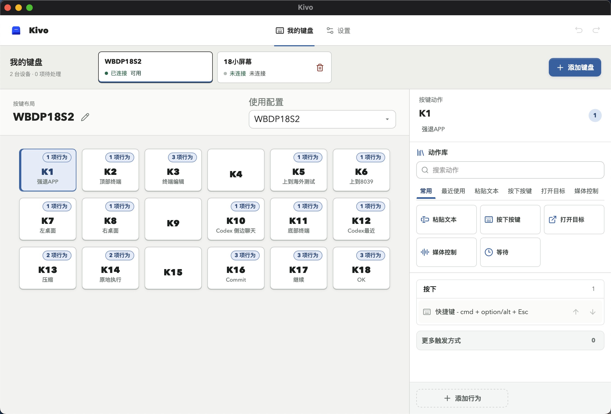

# Kivo

把实体按键变成电脑里的文字、快捷键和自动化动作。

[下载最新版本](https://github.com/leowzz/kivo/releases/latest) · [快速上手](#快速上手) · [刷入固件](#刷入固件) · [本地开发](#本地开发)


Kivo 包含两个独立的 Tauri 桌面入口：日常使用的 **Kivo APP**，以及配置产品、硬件和固件的 **Kivo Studio**。APP 从设备读取产品定义，负责按键动作；Studio 负责生成产品固件并检查 GPIO 电平。

## 能做什么

- **执行桌面动作**：按顺序组合文字粘贴、快捷键、等待、媒体控制，以及打开应用、网址、文件或文件夹。
- **配置触发方式**：为按下、松开、长按和双击分别配置动作，并调整长按、双击的判定时间。
- **配置产品硬件**：Studio 编辑按键布局、直连 GPIO、触点矩阵、功能开关和显示模块。
- **测试 GPIO 电平**：Studio 实时展示板卡允许使用的 GPIO 高低电平，支持 YD-ESP32-S3 和 YD-RP2040。
- **管理多台设备**：每台产品设备独立选择动作配置；相同产品版本的设备可以共享配置，也可以复制一份单独修改。
- **兼容旧版配置**：通用固件仍可使用包含布局、动作和多个 Hardware Profile 的 Device Profile。
- **功能开关门控**：Hardware Profile 可把一个 GPIO 开关绑定到若干按钮；开关断开时，这些按钮不会执行动作。
- **编辑按键动作**：APP 展示设备键盘，支持动作列表、自动保存、撤销和重做。
- **迁移与恢复**：导入旧版设备配置，备份和恢复产品设备的动作配置及其选择关系；仍兼容恢复旧版全量备份。



## 快速上手

1. 从 [Releases](https://github.com/leowzz/kivo/releases/latest) 下载 macOS 安装包或 Windows x64 安装程序。
2. 已刷入产品固件的设备直接连接 USB 即可。裸板或需要更换固件的设备，先按[刷入固件](#刷入固件)选择产品固件或通用固件。通过身份与协议校验后，Kivo 会自动登记设备。
3. 产品固件会直接提供按键布局和硬件定义。在 APP 的“我的键盘”中选中设备，再选择或新建动作配置。
4. 点击按键，为不同触发方式编辑动作。修改自动保存，提供撤销和重做；修改共享配置会影响所有正在使用它的设备，需要独立设置时先复制配置。
5. 改接线、布局或显示模块时，使用 Studio 修改产品定义并重新构建固件。
6. 通用固件仍可使用已有 Device Profile：通过“添加键盘”选择兼容配置，或从“数据与备份”导入旧配置。

产品设备会按 Product Version ID 选择已有或默认动作配置。通用固件设备在获得有效 Runtime Assignment 前不会执行动作；编辑中的 Device Profile 不会自动替换其他设备正在使用的配置。

“数据与备份”中的“备份设备行为”导出产品动作配置与设备选择关系，不包含固件、布局、接线、统计数据或旧版 Device Profile，不能当作整个工作区的全量备份。设备 Flash 的备份与恢复在 Studio 的工具台完成。

## 刷入固件

先区分两类固件：

- **产品固件**：由 Studio 根据 `products/<product-version-id>/product.yaml` 构建，内嵌布局和接线，APP 可自动识别。使用已有产品时应选择对应产品产物；构建与刷写步骤见[本地开发](#本地开发)和[固件](#固件)。
- **通用固件**：Release 中按板卡命名的文件，不含具体产品定义，需要在 APP 中分配兼容的旧版 Device Profile。不要把它当作某个产品的预配置固件。

从 [Releases](https://github.com/leowzz/kivo/releases/latest) 下载的通用固件命名如下：

| 板卡 | 选择这个文件 |
|---|---|
| YD-ESP32-S3 | `kivo-vX.Y.Z-esp32s3.bin` |
| YD-RP2040 | `kivo-vX.Y.Z-rp2040.uf2` |

### YD-RP2040：拖入文件管理器

1. 让板卡进入 BOOTSEL 模式：
   - 板卡尚未连接时，按住 **BOOT**，插入 USB；看到 `RPI-RP2` 磁盘后松开 **BOOT**。
   - 板卡已经连接时，按住 **BOOT**，短按一次 **RESET**，然后松开 **BOOT**。
2. 在 Finder 或文件资源管理器中打开 `RPI-RP2`。
3. 把 `kivo-vX.Y.Z-rp2040.uf2` 拖进磁盘。复制完成后磁盘会自动退出，板卡会运行 Kivo 固件。

### ESP32-S3：在浏览器中选择固件

ESP32-S3 的下载模式不会显示成磁盘。请使用 Chrome 或 Edge：

1. 下载 `kivo-vX.Y.Z-esp32s3.bin`，打开 Espressif 官方的 [ESP Tool](https://espressif.github.io/esptool-js/)。
2. 按住板卡的 **BOOT**，短按一次 **RESET/RST**，然后松开 **BOOT**。
3. 点击 **Connect**，选择刚出现的 ESP32-S3 串口。
4. 点击 **Add File**，地址填写 `0x0`，选择下载的 `.bin` 文件。
5. 点击 **Program**。完成后短按一次 **RESET/RST**，板卡会运行 Kivo 固件。

只使用上表中与板卡匹配的文件。刷写完成后保持 USB 连接，Kivo 会自动检测设备。

## 配置怎样组合


| 概念 | 负责什么 |
|---|---|
| Product Definition | Studio 编辑并嵌入固件的产品身份、布局和硬件定义 |
| Product Configuration Profile | APP 编辑的触发设置与动作；同一 Product Version ID 的设备可以共享，修改影响所有选用它的设备 |
| Device Profile | 通用固件的旧版兼容格式，包含布局、动作及一个或多个 Hardware Profile |
| Hardware Profile | 面向具体板卡的接线拓扑、输入绑定和去抖设置 |
| Device | 一台有稳定硬件序列号的实体控制器；USB 端口不是设备身份 |
| Runtime Assignment | 把一个 Device Profile 和兼容的 Hardware Profile 分配给一台 Device |
| Editor Profile | 当前正在界面中编辑的 Device Profile，不影响其他设备运行 |

功能开关属于 Hardware Profile 的输入源，不会出现在按键布局中。配置时只需选择开关 GPIO 和受影响的按钮。开关闭合时启用按钮；断开或 helper 尚未确认开关状态时屏蔽按钮。被屏蔽的按键不会计入动作统计，正在执行的动作会完整结束。

## 硬件产品命名

Kivo 实体产品使用 `<product-family>-<controller>-k<key-count>[-<capability>...]-r<hardware-revision>`
形式的 Product Version ID。产品能力变体和 PCB 修订彼此独立，软件发布版本、固件
版本、生产批次和单台设备序列号不进入该 ID。

仓库目前包含 WBRP-K18 的 r02、r03 产品定义：RP2040、18 个独立实体按键、显示屏，
以及可旋转、可按压的编码器。例如：

```text
kivo-workbench-rp-k18-disp-encp-r03
```

其中 `rp` 表示 RP2040，`k18` 不包含编码器按压，`encp` 表示编码器同时支持旋转和按压。
当前这两份产品定义不声明麦克风能力。产品 YAML 的存在不代表对应 PCB 已可投产；
[`hardware/workbench-r03/`](hardware/workbench-r03/README.md) 仍标记为未布线的设计草稿。
完整字段定义、token 顺序和升级规则见[产品版本 ID 命名规范](docs/product-version-id-naming.md)。

## 支持的控制器

| 板卡 | Controller Family | 运行时 USB | 固件环境 | 上传命令 |
|---|---|---|---|---|
| YD-ESP32-S3 | ESP32-S3 | `303a:4002` | `esp32s3` | `make upload-esp32s3` |
| YD-RP2040 | RP2040 | `2e8a:102e` | `rp2040` | `make upload-rp2040` |

YD-RP2040 的 UF2 bootloader USB 标识为 `2e8a:0003`。Kivo 会先校验 USB 身份，再通过 `HELLO` 协议确认板卡和固件；不受该 Board Profile 支持的 GPIO 会被拒绝。

YD-RP2040 的 Hardware Profile 支持两种地址为 `0x3C` 的 OLED：原有 SSD1306 128x32 模块占用 SDA/SCL 两个 GPIO；`sh1106-1.3-128x64-ec11` 模块使用 SH1106 128x64 屏，并带 EC11 旋转、EC11 按压、确认和返回，共占用七个 GPIO。OLED 和控制面板占用的 GPIO 不会再分配给按键输入。

## Codex 状态屏

启用 OLED 的设备会显示本机 Codex 任务的低干扰状态：汇总画面为 `CODEX <N> RUN`，需要操作时显示 `NEEDS INPUT` 或 `APPROVAL NEEDED`，响应生成后短暂显示 `RESPONSE READY`，数据源不可用时显示 `CODEX OFFLINE`。Codex 数据源异常不会停止 Kivo 的按键 Runtime。

状态屏使用任务身份、工作目录和状态/生命周期信号，不展示对话正文、推理、工具内容或最终回复。SSD1306 使用 `ssd1306` 配置和 128x32 渲染器；SH1106 使用独立的 `sh1106` 配置和 128x64 渲染器。当前仓库的运行固件握手为 `HELLO 13`，不应再按旧协议版本选择显示固件。两种屏均固定为 rotation 0，互不迁移。

刷入固件后仍需分别在实体 SSD1306 和 SH1106 上检查文字与状态切换，并在 SH1106 模块上检查旋钮方向、按压、确认和返回。自动测试和固件构建不能替代物理屏幕与输入验收。


两种控制器共享按键扫描、去抖、协议和运行状态机，各自保留 USB/HID 平台适配。多台 ESP32-S3 与 YD-RP2040 可以同时在线：产品设备使用各自选择的产品动作配置，通用固件设备使用各自的 Runtime Assignment。

## 本地开发

需要：

- Node.js `>=24.12.0 <25` 与 npm `>=11.0.0 <12`；`.nvmrc` 和
  `packageManager` 记录 CI 使用的参考版本
- Rust stable 和 Tauri 2 所需的系统构建依赖
- Python `3.13`、[`uv`](https://docs.astral.sh/uv/) 与 PlatformIO
- macOS 或 Windows；发行工作流构建 macOS universal DMG 和 Windows x64 NSIS 安装程序
- 使用 `make` 目标需要 GNU Make；Windows 还需可用的 Bash。Git for Windows 可以提供 Bash，但 GNU Make 需要单独安装

```bash
git clone https://github.com/leowzz/kivo.git
cd kivo
cp .env.example .env

nvm install
nvm use
uv sync
npm ci
make client
```

`.env` 会被有意忽略，且只包含 `version=vX.Y.Z`。它为本地固件构建和 `make release` 提供仓库版本。

### 两个桌面入口

| 命令 | 用途 |
|---|---|
| `make client` | 启动 Kivo APP，管理设备和按键动作 |
| `make studio` | 启动 Kivo Studio，编辑产品定义、构建固件、测试 GPIO |
| `make helper-build-app` | 单独打包 APP |
| `make helper-build-studio` | 单独打包 Studio |
| `make helper-build` | 打包两个入口 |
| `make test` | 前端、两个 Rust 入口、固件逻辑与构建流程验证 |

浏览器开发使用 `npm run dev` 和 `npm run dev:studio`，默认端口分别为 1420 和 1421。
APP 的 `/?preview` 仅在开发环境提供交互预览；真实串口和文件操作需要 Tauri。

Studio 使用独立的应用标识和配置目录，不会启动 APP 的设备运行服务。产品定义编辑可以与 APP 同时运行；GPIO 测试需要独占目标串口，测试前退出 APP 或其他串口工具。

安装版 Studio 首次使用时需要选择包含 `products/` 和固件源码的 Kivo 仓库；构建、备份和刷写还依赖本机的 `uv`、PlatformIO 等工具链，安装桌面包本身并不等于已配置固件开发环境。

已保存产品的 Capabilities 可直接修改；能力变化会同步更新产品 ID，保存时创建对应的新变体。
构建完成后，日志面板提供“复制输出路径”和“刷入固件”。后者直接使用本次构建文件，筛选匹配板卡的设备，校验文件后确认覆盖；未保存的修改需要先保存并重新构建。

### 工具台

Studio 的“工具台”集中提供刷新设备列表、备份固件、刷入固件文件和刷入测试固件四项操作，并可查看 GPIO 高低电平。

- **刷新设备列表**：重新枚举受支持的板卡，操作按序列号定位所选物理设备。
- **备份固件**：读取整片 Flash，RP2040 保存为 UF2，ESP32-S3 保存为 BIN；同时保存 `.backup.json` 校验记录。读取失败不会覆盖已有备份。
- **刷入固件文件**：选择 RP2040 UF2 或 ESP32-S3 完整 Flash / factory BIN，检查芯片、文件结构和 SHA-256 后确认刷写。支持恢复备份；若文件附带产品 `manifest.json`，额外校验清单和刷写后的产品、构建身份。ESP32-S3 写入地址固定为 `0x0`，拒绝仅含应用、应写入 `0x10000` 的 BIN。
- **刷入测试固件**：自动构建所选板卡的临时 I/O 固件，首次刷入前备份原固件，完成后开始采样。测试固件不含产品接线、按键动作、矩阵扫描或显示驱动；安全 GPIO 默认上拉输入，可切换浮空或下拉，串口断开时回到上拉输入。Studio 每次开始测试时也会先为临时固件启用上拉，兼容默认浮空的旧测试固件。

原固件备份位于 `output/firmware-backups/<board>/<device>/`，工具台显示具体路径。备份按设备持久保存，重复刷测试固件会复用原备份，不会把测试固件覆盖到原备份。测试完成后停止采样，点击“刷入固件文件”，文件选择器会默认定位到原备份。恢复成功后保留备份文件并结束此次临时测试记录。

每次采样完成后约 125 ms 再次读取。已有产品固件若支持 `GPIO_READ`，也可直接查看当前电平，但工具台不会修改它的引脚模式或运行拓扑。瞬时 HIGH / LOW 不等于连通性；悬空输入、矩阵扫描和通信引脚可能变化，应结合接线判断。

操作需要已配置的 Kivo 仓库、`uv` 和 PlatformIO 工具链。操作期间设备选择、工作区切换和窗口关闭被锁定；请勿拔线，并先退出 APP 或其他串口工具。设备留在引导模式时，可在当前视图直接重试，仍按原序列号定位设备。RP2040 自动进入与定位 BOOTSEL 沿用现有 macOS / Windows 上传工具。

备份文件是设备的完整 Flash 镜像，APP 动作配置仍使用 APP 的配置备份。`make build-io-test` 可单独构建两种测试固件，产物位于 `output/io-test/`；此命令不会操作硬件。

入口边界、目录职责和诊断协议见[架构说明](docs/architecture.md)。逐键学习已从界面、桌面协议和固件移除。

仓库的 `.envrc` 会加载 `.nvmrc` 中的精确 Node 版本。使用 direnv 时可以验证实际解析到的工具：

```bash
direnv allow
direnv exec . node --version
direnv exec . npm --version
```

预期分别输出 `v24.18.0` 和 `11.16.0`。

Windows PowerShell 不需要 direnv。安装 `.nvmrc` 中的版本后可以直接启动：

```powershell
nvm install 24.18.0
nvm use 24.18.0
npm install --global npm@11.16.0
Copy-Item .env.example .env
uv sync
npm ci
uv run python scripts/kill_helper.py
npm run tauri dev
```

本地环境只要落在上述兼容范围内即可，不要求与 CI 的参考版本完全一致。

`make release` 默认递增 patch；`make release V=vX.Y.Z` 可指定版本。脏工作树会被拒绝，跟踪的包版本会以 `chore: release vX.Y.Z` 提交，最后才创建带注释的 tag。

## 固件

分别构建两个通用固件目标（不内嵌产品定义）：

```bash
make build-esp32s3
make build-rp2040
```

分别上传；不要使用泛化的 `make upload`：

```bash
make upload-esp32s3
make upload-rp2040
```

产品固件可以在 Studio 中构建，也可以指定产品 YAML：

```bash
make build-product PRODUCT=products/kivo-workbench-rp-k18-disp-encp-r03/product.yaml
```

产物写入 `output/products/<product-version-id>/<build-id>/`，其中包含固件、产品定义和 `manifest.json`。刷写已有产品产物时使用：

```bash
make upload-prod
```

命令会先选择已连接的设备，再扫描与板卡匹配的产品固件；确认后完成刷写，并用固件内嵌的 Product Version ID 和 Build ID 校验启动协议。需要固定设备或固件时可以直接指定：

```bash
make upload-prod SERIAL=E0C9125B0D9B \
  FIRMWARE=output/products/<product-version-id>/<build-id>/firmware.uf2
```

`FIRMWARE` 只能指向 `output/products/` 下与目标板卡匹配的 `.uf2`（RP2040）或 `.bin`（ESP32-S3）产品产物；未指定时会在终端选择器中列出全部可用版本。

当同时连接多块同型号板卡时，用稳定硬件序列号指定目标：

```bash
make upload-esp32s3 SERIAL=ABCDEF123456
make upload-rp2040 SERIAL=E0C9125B0D9B
```

监控固件的 USB CDC 串口（默认 `115200` 波特率）：

```bash
make monitor                 # 默认选择 RP2040
make monitor-rp2040
make monitor-esp32s3
```

未传 `SERIAL` 时会打开设备选择器；也可以直接指定设备和波特率：

```bash
make monitor-rp2040 SERIAL=E0C9125B0D9B
make monitor-esp32s3 SERIAL=ABCDEF123456 BAUD=921600
```

监控命令会先停止可能占用串口的 Kivo helper。按 `Ctrl+C` 退出监控。

## 测试与构建

```bash
make test
make helper-build
```

`make test` 会运行发布脚本测试、Python 上传/选择测试、PlatformIO native 测试、Rust 测试与 Clippy、前端测试和生产构建。`make helper-build` 会连续构建 Kivo 和 Kivo Product Studio 两套包：macOS 生成应用包，Windows 生成对应的 NSIS 安装程序。Windows CI 也会在每次 pull request 中验证两套 NSIS 安装程序。

## 项目结构

```text
src/app/             APP 入口、设备管理、动作编辑、设置与备份
src/studio/          Studio 入口、产品定义编辑、固件构建与 GPIO 测试
src/shared/          两个前端入口共享的领域类型和基础样式
src-tauri/src/app/   APP 启动、运行服务装配与 IPC 命令
src-tauri/src/studio.rs  Studio 启动、产品仓库和构建命令
src-tauri/src/studio/    独立串口诊断会话
firmware/src/        固件入口与 ESP32-S3、RP2040 平台适配
lib/gpio_trigger/    板卡无关的输入拓扑、去抖与协议状态机
models/prod/         随应用发布的旧版 Device Profile
products/            Studio 管理的产品定义
hardware/            PCB、接线与硬件设计资料（完成状态见各目录说明）
scripts/             固件选择、上传与运行时验证工具
test/                Python、PlatformIO 与发布流程测试
docs/                硬件改造、兼容性与设计记录
```

领域术语以 [`CONTEXT.md`](CONTEXT.md) 为准，实体产品版本命名见
[`docs/product-version-id-naming.md`](docs/product-version-id-naming.md)。电话硬件改造和
电气安全要求见 [`docs/telephone-usb-voice-terminal-mod-guide.md`](docs/telephone-usb-voice-terminal-mod-guide.md)；
改造设备必须彻底隔离原 PSTN 电话线路。

## 平台状态

Kivo 支持 macOS 和 Windows 10/11 x64。Windows 使用原生 Unicode 剪贴板、系统托盘、COM/PnP 设备发现、按硬件身份锁定的 ESP32-S3/RP2040 上传流程，以及 x64 NSIS 安装程序。Windows 安装包目前未做代码签名，首次运行时可能显示系统信誉提示。
