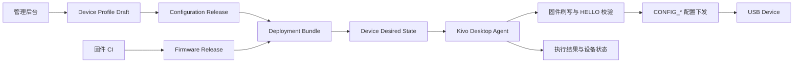
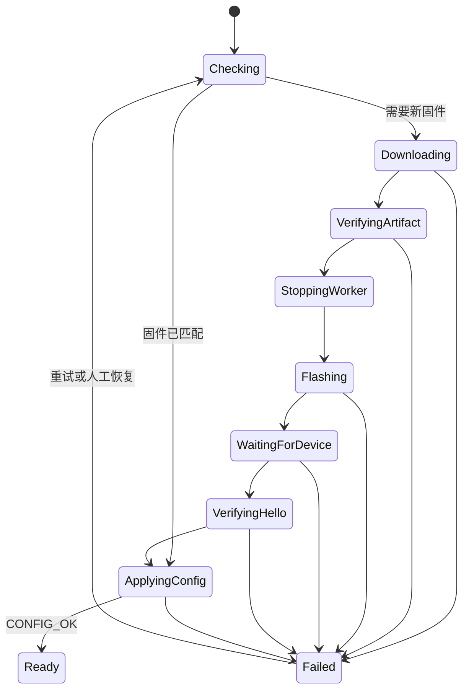

# Kivo 后台固件与配置管理设计

> 状态：Draft / Future
>
> 本文只描述未来后台、管理端和 Kivo 桌面端之间的目标架构，不代表当前已经实现，
> 也不改变当前本地 Device Profile、Runtime Assignment 或固件上传行为。

## 1. 背景

Kivo 当前已经能够在桌面端维护 Device Profile，并通过 USB 串口协议把 Hardware
Profile 中的输入拓扑原子地下发给固件。现有配置可以表达：

- 可视按键布局：按键分组、每组列数、按键 ID 和显示名称；
- 直连按键：按键 ID 到 GPIO 的映射；
- 接点矩阵：按键 ID 到两个 GPIO 接点的映射；
- 功能开关：GPIO、开关名称以及受其控制的按键集合；
- SSD1306 屏幕：SDA 和 SCL 引脚；可选的 OLED + EC11 控制模块还包含确认、
  编码器按压、编码器 A/B 相和返回五路 GPIO；
- 按下、释放、长按、双击对应的动作；
- Device Profile、Hardware Profile 与具体 Device 的 Runtime Assignment。

当前缺少一个中心化后台来管理固件产物、配置版本、设备期望状态、灰度发布和设备执行结果。
固件构建和上传仍然是本地开发流程，Device Profile 和 Runtime Assignment 也只保存在本机。

## 2. 设计结论

后台必须把“固件发布”和“配置发布”建模为两个独立对象，再通过一个部署包组合起来。

- **Firmware Release**：面向一个 Board Profile 的通用固件产物。它实现设备协议、输入扫描、
  HID 和屏幕驱动，不为每套按键或接线配置单独编译。
- **Configuration Release**：已发布且不可变的 Device Profile 快照，包含按键布局、Hardware
  Profile、动作和触发参数。
- **Deployment Bundle**：后台给运营人员看到的完整部署单元，组合 Firmware Release、
  Configuration Release、选定的 Hardware Profile 和目标 Product Version。
- **Desired State**：某台 Device 应当收敛到的 Deployment Bundle。

后台不直接连接 USB 设备。Kivo 桌面端作为设备代理，负责从后台获取 Desired State、下载并校验
固件、执行板卡相关刷写、等待设备重新枚举、校验 HELLO，再下发配置。



## 3. 目标与非目标

### 3.1 目标

1. 在管理后台完成一套可发布的设备定义，包括按键布局、I/O 用途、矩阵接线、开关、屏幕和动作。
2. 管理 ESP32-S3、RP2040 等不同 Board Profile 的固件版本和产物。
3. 将一个固件版本与一个配置版本组合后分配给单台设备或设备组。
4. 由 Kivo 桌面端可靠地执行升级和配置下发，并报告每个阶段的结果。
5. 支持离线缓存、失败重试、灰度发布、审计和人工恢复。
6. 保持现有未托管设备的本地工作方式，不因后台不可用而失效。

### 3.2 非目标

1. 后台不接受任意代码并按配置即时编译固件。
2. 后台不允许运营人员修改安全 GPIO 白名单、USB VID/PID 或 Controller Family 实现。
3. 第一阶段不要求设备直接联网；网络连接仍由 Kivo 桌面端提供。
4. 第一阶段不保证固件脱离 Kivo 桌面端后独立执行主机动作。
5. 第一阶段不把实时屏幕帧或高频按键事件上传到后台。

## 4. 领域边界

本文沿用 `CONTEXT.md` 中的领域术语。

| 对象 | 所有者 | 是否可由后台编辑 | 说明 |
| --- | --- | --- | --- |
| Product Family / Variant | 产品目录 | 受控 | 实体产品系列及不可变的用户可见能力集合 |
| Product Version | 产品目录 | 发布后不可变 | Product Variant 与 Hardware Revision 的完整组合 |
| Controller Family | 代码仓库 | 否 | MCU 平台共享的固件适配和协议行为 |
| Board Profile | 代码仓库 | 否 | USB 身份、安全 GPIO、能力和固件构建目标 |
| Device Profile Draft | 后台 | 是 | 尚未发布、可反复编辑的完整配置 |
| Configuration Release | 后台 | 否 | Device Profile Draft 发布后的不可变快照 |
| Firmware Release | CI / 后台 | 否 | CI 构建并上传的板卡固件产物 |
| Deployment Bundle | 后台 | 是 | 固件、配置和 Hardware Profile 的兼容组合 |
| Device | 桌面端发现，后台登记 | 部分 | 由 Board Profile 与硬件序列号组成稳定 Device ID |
| Desired State | 后台 | 是 | 某台 Device 需要收敛到的部署包 |
| Runtime Assignment | 桌面端运行时 | 间接 | Desired State 在本机落地后的运行关联 |

Product Version ID 遵循 `docs/product-version-id-naming.md`，标识实体产品的能力变体和硬件修订。
它不替代固件版本、Board Profile ID、Device ID 或 Device Profile ID。仅升级固件或修改可下发配置
不会改变 Product Version ID；PCB、引脚或已登记公开能力变化时，按命名规范创建新的 Product
Version。

Board Profile 是硬件安全边界。后台可以读取和展示它的能力，但不能把一个未列入安全白名单的
GPIO 通过配置变成可用引脚。新增板卡、修改 USB 身份或扩展屏幕驱动时，必须先通过代码发布新的
Board Profile 和兼容固件。

## 5. 完整配置模型

### 5.1 复用 Device Profile schema

Configuration Release 的配置主体复用现有 `DeviceProfile schema_version: 3`，不创建第二套
同义格式。发布信封增加后台版本信息和内容摘要：

```json
{
  "release_id": "cfgrel_01J...",
  "release_number": 12,
  "device_profile_id": "key9",
  "content_sha256": "...",
  "published_at": "2026-08-14T10:00:00Z",
  "device_profile": {
    "schema_version": 3,
    "profile": {},
    "trigger_settings": {},
    "hardware_profiles": [],
    "actions": {}
  }
}
```

Draft 可以修改；Release 一旦发布便不可原地修改。修正已发布配置时必须创建新的 release number。

### 5.2 I/O 分配视图

管理后台应以 Board Profile 的 `safe_pins` 为基础，显示每个可用 GPIO 的占用情况：

| I/O 用途 | Device Profile 中的来源 |
| --- | --- |
| 未使用 | 未出现在当前 Hardware Profile 中 |
| 直连按键 | `InputSource.Direct.keys` |
| 矩阵行 / 列 | `InputSource.ContactMatrix.keys` 的二分图分区 |
| 功能开关 | `InputSource.FeatureSwitch.gpio` |
| 屏幕 SDA / SCL | `HardwareProfile.ssd1306` |
| OLED + EC11 模块控制信号 | `HardwareProfile.ssd1306.control_panel` |

“每个 I/O 的用途”是以上配置推导出的管理端视图，不额外保存一份可能产生冲突的 GPIO 用途表。
未使用引脚在 UI 中明确显示，但在发布 JSON 中保持省略。

发布前必须验证：

- 所有 GPIO 都属于目标 Board Profile 的安全集合；
- 同一 Hardware Profile 内一个 GPIO 只能被一个来源占用；
- 同一个按键不能绑定到多个物理输入；
- 矩阵接点必须能够形成合法二分图，且接点组合不能重复；
- SSD1306 只能用于声明支持 OLED 的 Board Profile；普通屏占用 SDA/SCL 两路，
  `ec11_confirm_back` 模块占用 SDA/SCL、确认、编码器按压、编码器 A/B 相和返回共七路，
  所有引脚必须互不重复；
- Feature Switch 引用的按键必须存在；
- Device Profile 所需协议版本不能高于目标 Firmware Release 的协议版本。

### 5.3 两种“行列”必须分开

后台 UI 不得混淆以下两个概念：

1. **可视按键布局**：`profile.groups[].columns`，决定管理端和 Kivo 桌面端如何排布按键。
2. **电气矩阵行列**：`ContactMatrix` 中 GPIO 接点形成的行列分区，决定固件如何扫描矩阵。

初版继续沿用 schema v3，由接点关系推导电气矩阵的行列分区。只有在未来确实需要固定行列方向、
连接器针脚名称或二极管方向时，才升级 Device Profile schema，不在后台私自增加不被桌面端理解的字段。

### 5.4 屏幕能力

当前配置表达 SSD1306 的 SDA/SCL，也可为带 EC11、确认键和返回键的成品模块配置额外五路
控制 GPIO。这五路属于显示组件，不进入可视按键布局，也不增加 Product ID 的 `kNN`。
其他屏幕类型、SPI 屏幕、屏幕旋转、分辨率或多个屏幕都需要：

1. 扩展 Board Profile 能力；
2. 升级 Device Profile schema；
3. 升级固件协议；
4. 同步升级桌面端和后台校验器。

## 6. 固件发布模型

Firmware Release 至少包含：

| 字段 | 说明 |
| --- | --- |
| `firmware_release_id` | 不可变发布 ID |
| `version` | 用户可读语义版本，例如 `v0.7.0` |
| `build_id` | HELLO 返回的精确构建标识 |
| `controller_family_id` | `esp32s3`、`rp2040` 等 |
| `board_profile_id` | 目标 Board Profile |
| `protocol_version` | 固件运行协议版本 |
| `artifact_kind` | `esp32s3_factory_bin`、`rp2040_uf2` 等 |
| `artifact_url` | 对象存储地址或短期下载地址 |
| `size_bytes` | 下载前校验大小 |
| `sha256` | 内容完整性校验 |
| `signature` | 生产发布签名；签名算法和密钥版本单独记录 |
| `min_desktop_version` | 能执行该升级的最低 Kivo 桌面端版本 |
| `git_commit` | 构建来源 |
| `release_notes` | 变更说明 |
| `status` | `draft`、`published`、`withdrawn` |

后台不承担 PlatformIO 编译。固件由可信 CI 构建，上传产物和元数据，后台完成发布审批与分发。
ESP32-S3 使用可完整刷写的 factory image，RP2040 使用 UF2；具体刷写实现仍属于桌面端板卡适配器。

## 7. Deployment Bundle 与兼容性

Deployment Bundle 包含：

- 一个目标 Product Version ID；
- 一个 Firmware Release；
- 一个 Configuration Release；
- Configuration Release 中的一个 Hardware Profile ID；
- 可选的发布渠道、备注和最低桌面端版本；
- 不可变的兼容性检查结果摘要。

创建 Deployment Bundle 时必须同时满足：

1. Product Version 允许使用该 Hardware Profile 对应的 Board Profile 和公开能力；
2. Firmware Release 与 Hardware Profile 的 `board_profile_id` 相同；
3. 固件协议版本不低于 Device Profile 的 `minimum_protocol_version`；
4. 桌面端版本能够理解目标配置 schema 和固件升级方式；
5. 固件产物类型与 Board Profile 的刷写适配器匹配；
6. Product Version、Firmware Release、Configuration Release 均处于已发布状态。

后台发布校验不是最后一道安全检查。桌面端在刷写前和下发配置前必须重新执行兼容性校验；固件自身
仍需拒绝非法 GPIO、重复来源和错误 revision。

## 8. 数据模型

建议的逻辑表如下。遵循项目约定，只保存逻辑 ID 和索引，不创建物理数据库外键。

### 8.1 `product_versions`

保存 Product Family ID、Product Variant ID、Hardware Revision、Product Version ID、公开能力集合和
状态。ID 和能力含义遵循 `docs/product-version-id-naming.md`，发布后不可修改。建议唯一索引：

- `product_version_id`；
- `(product_variant_id, hardware_revision)`。

Product Version 与允许的 Board Profile、Hardware Profile 之间使用独立的逻辑兼容关系，不把固件
版本写入 Product Version ID。

### 8.2 `firmware_releases`

保存固件元数据、产物摘要、签名、状态和构建来源。建议唯一索引：

- `(board_profile_id, build_id)`；
- `(board_profile_id, version)`；
- `sha256`。

### 8.3 `device_profile_drafts`

保存当前编辑内容、编辑 revision、最后编辑人和更新时间。更新使用乐观锁：请求必须携带当前
`editing_revision`，服务端成功保存后递增。

### 8.4 `configuration_releases`

保存不可变 Device Profile JSON、release number、SHA-256、发布人和发布时间。建议唯一索引：

- `(device_profile_id, release_number)`；
- `content_sha256`。

### 8.5 `deployment_bundles`

保存 Product Version ID、固件发布 ID、配置发布 ID、Hardware Profile ID、状态和兼容性摘要。
发布后不可修改。

### 8.6 `managed_devices`

保存 Device ID、Product Version ID、Board Profile ID、显示名称、当前上报版本、最后在线时间和
管理状态。硬件序列号是身份组成部分，不是认证凭据。

Product Version ID 不能只靠 USB 身份自动推断。设备首次纳管时由制造记录、预置清单或管理员明确
指定；后台校验它与实际 Board Profile 和能力是否兼容。

### 8.7 `device_desired_states`

保存 Device ID、目标 Deployment Bundle ID、desired revision、发布时间和发布人。同一 Device
只有一条当前 Desired State；每次变更递增 desired revision。

### 8.8 `device_operation_reports`

追加写入 check-in、下载、校验、刷写、重新枚举、HELLO 校验、配置下发和失败信息。报告必须包含
`operation_id`、`desired_revision`、阶段、结果、错误码、桌面端版本和时间戳。

### 8.9 `audit_events`

追加写入草稿修改、发布、撤回、设备分配、灰度调整和人工重试。敏感下载地址、访问令牌和签名私钥
不得写入审计详情。

## 9. API 草案

所有路径均为未来草案，不构成当前兼容承诺。

### 9.1 管理 API

```text
GET    /api/admin/v1/product-versions
GET    /api/admin/v1/board-profiles
POST   /api/admin/v1/device-profile-drafts
GET    /api/admin/v1/device-profile-drafts/{id}
PUT    /api/admin/v1/device-profile-drafts/{id}
POST   /api/admin/v1/device-profile-drafts/{id}/validate
POST   /api/admin/v1/device-profile-drafts/{id}/publish

POST   /api/admin/v1/firmware-releases
POST   /api/admin/v1/firmware-releases/{id}/publish
POST   /api/admin/v1/firmware-releases/{id}/withdraw

POST   /api/admin/v1/deployment-bundles
POST   /api/admin/v1/devices/{device_id}/desired-state
POST   /api/admin/v1/deployments
GET    /api/admin/v1/deployments/{id}
```

### 9.2 桌面代理 API

```text
POST   /api/agent/v1/check-ins
GET    /api/agent/v1/configuration-releases/{id}
POST   /api/agent/v1/operations/{operation_id}/reports
POST   /api/agent/v1/operations/{operation_id}/complete
```

Check-in 请求示例：

```json
{
  "agent_installation_id": "agent_01J...",
  "desktop_version": "0.7.0",
  "devices": [
    {
      "device_id": "vccgnd-yd-rp2040:SERIAL",
      "product_version_id": "workbench-one-rp-k18-mic-disp-encp-r01",
      "board_profile_id": "vccgnd-yd-rp2040",
      "controller_family_id": "rp2040",
      "firmware_build_id": "v0.6.11",
      "firmware_protocol": 8,
      "configuration_release_id": "cfgrel_01J...",
      "capabilities": [0, 1, 2, 3]
    }
  ]
}
```

响应只返回仍需执行的目标，不要求重复刷写已经收敛的 Device：

```json
{
  "operations": [
    {
      "operation_id": "op_01J...",
      "device_id": "vccgnd-yd-rp2040:SERIAL",
      "desired_revision": 14,
      "firmware": {
        "release_id": "fwrel_01J...",
        "build_id": "v0.7.0",
        "artifact_url": "https://download.example/...",
        "size_bytes": 123456,
        "sha256": "...",
        "signature": "..."
      },
      "configuration": {
        "release_id": "cfgrel_01J...",
        "hardware_profile_id": "hardware",
        "content_sha256": "..."
      }
    }
  ]
}
```

下载地址应当短时有效。Agent API 必须支持幂等：同一个 `operation_id + desired_revision` 重复上报
不得创建多个并行刷写任务。

## 10. 桌面端执行状态机

固件与配置不能视为一个原子操作。只有两个部分都成功，Device 才算收敛到 Desired State。



执行顺序固定为：

1. 锁定目标 Device，禁止同一 Device 并行执行学习、配置或刷写；
2. 下载固件到临时文件，校验大小、SHA-256 和发布签名；
3. 暂停该 Device 的串口 worker，释放端口；
4. 通过 Board Profile 对应的刷写适配器进入 bootloader 并刷写；
5. 等待同一个 Device ID 重新以 runtime mode 枚举；
6. 校验 HELLO 中的 Controller Family、Board Profile、协议和 build ID；
7. 校验并缓存 Configuration Release；
8. 通过 `CONFIG_BEGIN`、`CONFIG_*`、`CONFIG_COMMIT` 原子下发 Hardware Profile；
9. 收到匹配 revision 的 `CONFIG_OK` 后更新本地 Runtime Assignment；
10. 向后台报告成功，并释放设备操作锁。

若固件已经匹配，只执行第 7 至第 10 步。若固件刷写成功但配置失败，设备状态是
`firmware_updated_config_failed`，不能错误标记为 Ready。

## 11. 失败处理与回滚

### 11.1 配置失败

- 桌面端保留上一份已验证的 Configuration Release；
- 新配置收到 `CONFIG_ERROR` 或超时后，重新下发上一份 Hardware Profile；
- 后台记录失败的 desired revision，不自动把 Desired State 改回旧版本；
- 达到重试上限后等待人工处理，避免无限重连和重复占用 USB。

### 11.2 固件失败

- 下载或签名校验失败时不得进入 bootloader；
- 刷写后必须以 HELLO 精确验证 build ID，不能只根据端口重新出现判断成功；
- 本地缓存上一份固件产物，但自动回刷是否可用取决于板卡当前模式和 bootloader 状态；
- RP2040 与 ESP32-S3 不共享同一套回滚保证，因此后台只记录统一状态，不宣称设备具备原子固件回滚；
- 生产发布应先灰度，观察成功率后再扩大范围。

### 11.3 后台或网络不可用

- 已经正常运行的设备继续使用本地 Workspace 和最后一次成功的 Runtime Assignment；
- 后台不可用不能清空本地配置，也不能阻止现有设备连接；
- 未完成的固件下载可重试，已验证的完整产物可以离线使用；
- check-in 和执行报告使用有上限的退避，不阻塞本地按键处理。

## 12. 并发与一致性

1. Draft 更新使用 `editing_revision` 乐观锁，冲突时返回最新版本，不做静默覆盖。
2. Desired State 使用单调递增的 `desired_revision`；Agent 只执行自己已确认的 revision。
3. 每台 Device 同时最多存在一个活动 `operation_id`。
4. 新 Desired State 到达时，如果旧操作尚未进入刷写阶段，可以取消旧操作；进入刷写后必须完成设备恢复和
   HELLO 验证，再重新计算目标。
5. Firmware Release、Configuration Release 和 Deployment Bundle 发布后不可变。
6. 后台显示的“已完成”必须来自 Agent 的最终报告，不能由任务已创建或固件已下载推断。

## 13. 安全

- 管理端至少区分查看、编辑、发布三个权限；发布固件和大范围部署需要更高权限。
- 桌面端安装实例使用可撤销的 Agent 凭据；Device ID 和硬件序列号只用于识别，不用于认证。
- Firmware Release 使用 SHA-256；生产环境使用离线发布私钥签名，桌面端内置或安全更新公钥。
- 后台只保存公钥或密钥版本，不保存可直接导出的生产签名私钥。
- Configuration Release 也记录内容摘要，下载后再次校验。
- 固件和配置下载使用 TLS 与短期地址；日志和审计不得记录令牌、签名私钥或完整预签名 URL。
- 后台不能绕过桌面端和固件的 Board Profile、安全 GPIO 与协议校验。

## 14. 管理后台信息架构

后台是面向运营和硬件配置人员的工作台，不进入普通用户的设备设置流程。

1. **产品目录**：Product Family、Product Variant、Hardware Revision 和 Product Version。
2. **设备配置**：Device Profile 列表、草稿状态、发布版本和编辑入口。
3. **按键与动作**：可视布局、按键名称、触发方式和动作序列。
4. **I/O 分配**：Board Profile 引脚图、占用状态、直连键、矩阵、开关和屏幕配置。
5. **固件版本**：按 Board Profile 查看构建、协议、产物摘要、渠道和撤回状态。
6. **部署包**：选择 Product Version、固件、配置和 Hardware Profile，检查兼容性后发布。
7. **设备**：当前状态、期望状态、最后在线时间、失败阶段和人工重试。
8. **发布记录**：灰度进度、成功率、错误分布和审计事件。

I/O 编辑属于高级硬件配置。管理端仍应把“按键布局”和“电气矩阵”分开呈现，避免让非硬件用户
直接面对 GPIO 细节。

## 15. 推荐技术边界

以下是未来实施时的默认建议，不是当前仓库依赖：

- 后端：FastAPI、Pydantic、SQLAlchemy 2；
- 初期数据库：SQLite WAL；需要多实例或更高并发时迁移到 PostgreSQL；
- 固件产物：开发环境本地文件存储，生产环境使用 S3/OSS 兼容对象存储；
- 管理端：React，复用现有 Device Profile TypeScript 类型和可编辑组件的数据契约；
- Python 依赖管理：uv；
- 本地启动入口：保持 `make dev` 风格，但后台实施前不得改变当前默认启动行为。

后台与 Rust 桌面端会分别实现配置校验。为避免规则漂移，必须维护同一组有效/无效配置 fixture，
在 Python 和 Rust 测试中执行一致性验证。桌面端和固件仍是接触硬件前的最终防线。

## 16. 演进阶段

### Phase 0：契约固定

- 固定 Configuration Release 信封、Firmware Release 元数据和 Deployment Bundle 契约；
- 固定 Product Version 与 Board Profile、Hardware Profile 的兼容关系；
- 整理 Rust/Python 共用的配置 fixture；
- 明确设备是否必须支持脱离 Kivo 桌面端独立工作；
- 明确管理端认证方式、部署环境和固件签名方案。

### Phase 1：后台最小闭环

- Device Profile Draft 保存、校验和发布；
- Firmware Release 登记和产物上传；
- Deployment Bundle 创建；
- 单台 Device Desired State；
- 管理后台能够查看状态，但暂不自动升级真实设备。

### Phase 2：桌面代理同步

- Agent check-in 和本地缓存；
- 配置下载、校验与 `CONFIG_*` 下发；
- 未托管和托管模式并存；
- 完成状态、错误码和审计闭环。

### Phase 3：固件升级

- 将现有 ESP32-S3、RP2040 上传逻辑封装为桌面端刷写适配器；
- 固件下载、摘要/签名校验、端口释放、重新枚举和 HELLO 验证；
- 单台人工升级和失败恢复。

### Phase 4：规模化发布

- 设备组、渠道和灰度百分比；
- 暂停、继续、撤回和失败阈值；
- 发布看板、错误聚合和批量人工恢复；
- PostgreSQL、对象存储和高可用部署。

## 17. 实施前待确认事项

1. Device 是否必须在没有 Kivo 桌面端连接时独立扫描并执行动作？若必须，需要额外设计固件持久化、
   本地动作解释器和配置恢复机制。
2. 后台是单组织内部工具，还是未来需要多租户？初版默认单组织。
3. 固件更新是否允许无人值守自动执行？建议初版只支持人工确认，稳定后再开放灰度自动升级。
4. 管理员身份来自现有 SSO、反向代理，还是后台自带账号？
5. Device Profile 在托管模式下是否仍允许桌面端本地修改？建议远端发布版本只读，本地修改需要复制为
   新草稿，避免静默覆盖。
6. 生产固件签名密钥由哪套发布基础设施托管和审批？
7. 单台 Device 的 Product Version 来自制造清单、出厂预置还是首次纳管时人工选择？

在以上事项确认并进入实施阶段之前，本设计保持 Future 状态，不应据此改变当前用户工作流。

## 18. 当前实现参考

- `CONTEXT.md`：Kivo 领域术语以及 Product Version、Device Profile、Board Profile 等身份边界；
- `docs/product-version-id-naming.md`：实体产品版本 ID 的组成和变更规则；
- `src-tauri/src/profile.rs`：Device Profile、Hardware Profile、Input Source 和语义校验；
- `src-tauri/src/protocol.rs`：Hardware Profile 到 `CONFIG_*` 命令的转换；
- `src/main.cpp`：固件端配置事务、HELLO 和运行时输入扫描；
- `src-tauri/src/hardware.rs`：编译期 Board Profile、安全 GPIO 和固件环境；
- `Makefile` 与 `scripts/`：当前 ESP32-S3、RP2040 构建、上传和运行时验证流程。
