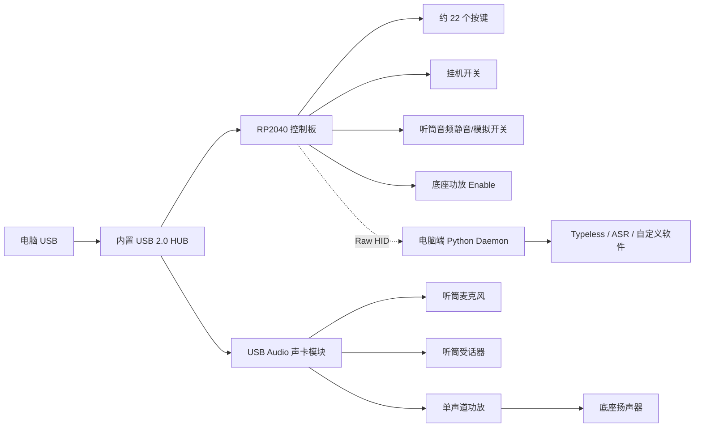

# 红色电话座机改造为 USB 语音终端

> 文档状态：设计草案 v0.1<br>
> 更新日期：2026-07-27<br>
> 目标设备：带听筒、卷线、挂机机构、数字键盘、功能键和底座扬声器的来电显示电话<br>
> 核心目标：拿起听筒开始 Typeless/ASR，对准听筒讲话；放下听筒结束；所有按键均可自定义；整机作为 USB 声卡和 USB 控制器使用。

---

## 1. 项目目标

本项目将原电话改造成一个桌面 USB 语音终端，保留原有外观和机械交互：

- 保留听筒、听筒仓、挂机压杆和可伸缩卷线。
- 听筒麦克风作为电脑麦克风。
- 听筒受话器作为电脑音频输出，使用体验接近单耳 USB 有线耳机。
- 拿起听筒时自动触发 Typeless、ASR 或其他可配置动作。
- 放下听筒时自动停止当前语音会话。
- 右侧约 22 个按键全部支持自定义映射。
- 底座扬声器用于提示音、TTS、免提播放或其他自定义用途。
- 最终只通过一根 USB 线连接电脑。
- 不再保留传统 PSTN 电话线路功能。

按照片估算，可用按键包括：

| 区域 | 数量 | 标签示例 |
|---|---:|---|
| 顶部功能键 | 5 | UP、DOWN、BACK、OUT、DEL |
| 数字键区 | 12 | 0～9、`*`、`#` |
| 底部小按键 | 4 | R、VOL、FL/SET、RD/PA |
| 大免提键 | 1 | SPEAKER |
| 挂机开关 | 1 个状态输入 | ON_HOOK / OFF_HOOK |

右侧按键合计约 22 个，另有一个挂机状态输入。

---

## 2. 不在第一版范围内的功能

第一版不建议同时追求以下目标：

- 继续接入真实电话线。
- 复用原电话主控芯片、来电显示、拨号和振铃逻辑。
- 复用原段码 LCD。
- 直接实现高质量全双工免提和声学回声消除。
- 第一版就制作全定制 PCB。

传统电话主板通常把键盘扫描、段码 LCD、拨号、线路接口和铃声集成在专用芯片中。保留它会显著增加逆向难度，并可能把电话线路电压引入 USB 设备。推荐把原机仅作为外壳、机械结构、按键机构和音频器件的载体。

---

## 3. 推荐总体方案

### 3.1 原型架构



### 3.2 推荐器件组合

第一版推荐：

- **控制器**：RP2040 Pro Micro、RP2040-Zero、Raspberry Pi Pico 或其他 QMK 支持的 RP2040 板。
- **按键固件**：QMK，启用 Raw HID。
- **USB 音频**：CM108B USB 声卡模块。
- **底座扬声器功放**：PAM8301 或 PAM8302A 单声道 Class-D 模块。
- **USB 合并**：成品两口 USB HUB 小板；后续定制板可考虑 TUSB2046B。
- **电脑端控制**：Python daemon，通过 Raw HID 接收按键和挂机事件。

第二版定制 PCB 可把 CM108B 模块替换为 PCM2912A 等 USB Audio Codec，把 HUB、RP2040、音频 Codec 和功放集成到一块板上。

### 3.3 为什么采用“声卡 + 控制器 + HUB”

这种方案把复杂问题拆成两个标准 USB 设备：

1. USB Audio 设备负责录音和播放。
2. USB HID/Raw HID 设备负责挂机开关和自定义按键。

优势：

- 操作系统通常不需要额外声卡驱动。
- 音频和控制逻辑互不影响，便于分阶段调试。
- QMK 能稳定处理矩阵键盘、去抖、宏和 Raw HID。
- 最后通过内部 HUB 合并成一根 USB 线。
- 即使电脑端 daemon 崩溃，固件仍能执行硬件静音和功放关闭。

---

## 4. 安全要求

> **完成改造后，原电话线接口必须彻底断开、拆除或封堵。不要再把设备接入墙上的电话线。**

传统电话线路可能带有直流馈电和更高的振铃电压。即使设备已经废弃，也不应让原线路部分与 USB 地、电源或人体可触及部件保持连接。

必须遵守：

- 拆机前拔掉所有外部线缆和电池。
- 不要在设备通电时测量电阻或通断。
- 原电话线接口与新电路之间不允许并联共存。
- 不要把 Class-D 功放的任一扬声器输出端接地。
- 不要把 USB 声卡左右声道输出直接短接。
- 不要直接焊接在按键黑色碳膜触点上。
- 第一次接听筒受话器时，从低音量和较大串联电阻开始。
- 在最终封壳前进行短路、温升和 USB 断连测试。

---

## 5. 建议 BOM

### 5.1 核心模块

| 器件 | 数量 | 用途 | 备注 |
|---|---:|---|---|
| RP2040 控制板 | 1 | 扫描按键、挂机状态、Raw HID | 优先选择 USB-C 和 GPIO 足够的版本 |
| CM108B USB 声卡模块 | 1 | 麦克风输入、耳机输出 | 原型优先使用成品模块 |
| 两口 USB 2.0 HUB 小板 | 1 | 合并 RP2040 和 USB 声卡 | 原型阶段可暂时不用 |
| PAM8301/PAM8302A 功放模块 | 1 | 驱动底座扬声器 | 必须具有 Shutdown/Enable 更好 |
| 模拟音频开关 | 1～2 | 听筒输出静音、麦克风硬静音 | 可选，例如 TS5A23157 一类器件 |
| JST 插座及端子 | 若干 | 模块化连接 | 便于拆机维护 |
| 屏蔽线或双绞线 | 若干 | 麦克风、模拟音频 | 麦克风线优先屏蔽 |

### 5.2 常用无源器件

| 器件 | 建议值 | 用途 |
|---|---|---|
| 电解电容 | 100 µF | 听筒受话器隔直，按声卡输出结构调整 |
| 电解电容 | 470～1000 µF | 功放附近 5V 储能 |
| 陶瓷电容 | 100 nF、1 µF | 各模块电源去耦 |
| 串联电阻 | 47Ω、100Ω、220Ω | 听筒受话器限流和音量调试 |
| 混音电阻 | 1kΩ～4.7kΩ | 左右声道安全混合，不能直接短接 |
| 上拉电阻 | 10kΩ | 挂机开关和独立按键输入 |
| 去抖电容 | 100 nF | 挂机开关硬件去抖 |
| 磁珠 | 可选 | 隔离数字电源和模拟音频噪声 |

### 5.3 可选升级

- 新的 6～10 mm 两线驻极体麦克风。
- 新的 8Ω、1W 或 2W 底座扬声器。
- 0.96/1.3 英寸 OLED，用于替换原段码 LCD。
- USB-C 面板母座或短延长线。
- 自定义按键 PCB。
- PCM2912A USB Audio Codec 定制板。

---

## 6. 拆机前记录

拆机前先建立可追溯记录，避免后续无法恢复机械结构。

建议拍摄：

1. 整机正面、背面和侧面。
2. 所有螺丝位置。
3. 上下壳打开后的整体走线。
4. 主板正反面高清照片。
5. 按键 PCB 正反面。
6. 挂机压杆、弹簧和开关结构。
7. 听筒内部麦克风和受话器。
8. 卷线进入听筒和底座的应力释放结构。
9. 底座扬声器标签和接线颜色。
10. 所有插座、排线和线色。

建议给所有线缆贴标签：

```text
HS-MIC+
HS-MIC-
HS-SPK+
HS-SPK-
BASE-SPK+
BASE-SPK-
HOOK-COM
HOOK-NO
HOOK-NC
```

---

## 7. 保留听筒卷线

### 7.1 原则

可伸缩卷线完全可以保留。通常听筒需要四根导线：

- 两根连接听筒受话器。
- 两根连接听筒麦克风。

不同电话的线序并不统一，不能直接照搬网上的 RJ9/RJ10 线序图。

### 7.2 两种保留方式

#### 方式 A：原卷线和原插座全部复用

适用于原卷线状态良好，且底座内部有可访问的焊点或 4P4C 插座。

优点：

- 外观最完整。
- 听筒可以保持原来的可插拔或固定结构。
- 不需要修改外壳。

#### 方式 B：保留外观，内部重新端接

适用于原线直接焊死、接触不良或线序无法方便利用。

做法：

- 保留原卷线本体。
- 在底座内部剪断并重新接到 JST 插座。
- 或把内部端改为 4P4C/RJ9 插座。
- 保留原有橡胶护套和应力释放夹，避免拉力作用在焊点上。

### 7.3 线序测量

断电状态下：

1. 打开听筒。
2. 直接观察四根线分别通向哪个器件。
3. 使用万用表通断档，从听筒端追踪到底座端。
4. 记录颜色、底座焊盘和实际用途。

建议在仓库中保存：

```markdown
| 底座端编号 | 线色 | 听筒端器件 | 极性 | 备注 |
|---|---|---|---|---|
| 1 | 待测 | 麦克风/受话器 | 待测 | |
| 2 | 待测 | 麦克风/受话器 | 待测 | |
| 3 | 待测 | 麦克风/受话器 | 待测 | |
| 4 | 待测 | 麦克风/受话器 | 待测 | |
```

---

## 8. 听筒音频逆向

## 8.1 识别麦克风类型

常见类型：

| 类型 | 外观/特征 | 处理建议 |
|---|---|---|
| 两线驻极体麦克风 | 小型金属圆柱体，通常有极性 | 最适合直接接 USB 声卡 Mic 输入 |
| 动圈麦克风 | 类似小型扬声器，通常无极性 | 可能需要更高增益前置放大 |
| 碳粒麦克风 | 老式较大的胶囊，阻值随声音变化 | 不建议复用，直接换驻极体麦克风 |
| 数字 MEMS 麦克风 | 小型 PCB，需要电源/时钟/数据 | 不适合四芯卷线结构 |

照片中的电话较新，原麦克风大概率是驻极体，但必须拆机确认。

### 8.2 驻极体麦克风接法

CM108B 类 USB 声卡模块通常已经在麦克风输入上提供偏置电压。应优先按模块原理图接入，不要重复叠加第二套偏置。

典型结构：

```text
USB 声卡 MIC Bias / MIC+
          │
          ├──────── 听筒驻极体麦克风正极
          │
USB 声卡 AGND ───── 听筒驻极体麦克风负极
```

注意：

- 驻极体麦克风通常有极性。
- 外壳与负极相连的概率较高，但不能只凭外观判断。
- 麦克风线应远离 USB D+/D-、RP2040 时钟线和 Class-D 扬声器输出。
- 麦克风信号尽量使用双绞线或屏蔽线。
- 如果原麦克风底噪大，直接替换成新的两线驻极体麦克风通常比调试原件更省时间。

### 8.3 听筒受话器测量

将受话器与原主板断开后测量直流电阻，并记录：

```markdown
| 项目 | 测量值 |
|---|---:|
| 听筒受话器直流电阻 | 待测 Ω |
| 原受话器是否有极性标记 | 待确认 |
| 1 kHz 播放是否正常 | 待测试 |
| 电脑 50% 音量主观响度 | 待测试 |
```

第一次连接建议：

```text
USB 声卡单声道输出
        │
      100 µF
        │
      220Ω
        │
    听筒受话器
        │
       GND
```

调试顺序：

1. 电脑音量设置为 10%～20%。
2. 串联电阻先用 220Ω。
3. 确认无异常发热、失真和爆音。
4. 音量不足时依次尝试 100Ω、47Ω。
5. 仍然不足时增加专用耳机/小功率受话器放大器，不要直接改用 2.5W 扬声器功放满功率驱动。

> 上述电容和电阻是原型起始值，不是所有声卡和受话器的固定参数。最终值应依据声卡输出结构、受话器阻抗和实测响度决定。

### 8.4 单声道处理

电话听筒是单声道。可选方案：

- 第一版只使用声卡左声道，并把电脑音频设置为单声道。
- 左右声道分别通过 1kΩ～4.7kΩ 电阻后再混合，绝不能直接短接。
- 定制板使用运放完成左右声道求和，并分别驱动听筒和底座功放。

第一版主要服务语音、ASR 和 TTS，通常使用单声道即可。

---

## 9. 底座扬声器

### 9.1 判断原器件是否可用

拆下扬声器一端后测量直流电阻：

- 约 6～12Ω：通常可作为普通动态扬声器使用。
- 接近开路或表现异常：可能是压电蜂鸣片、变压器耦合器件或损坏件。
- 声音失真严重：直接更换 8Ω、1W 左右的小扬声器。

### 9.2 推荐接法

```text
USB 声卡音频输出
        │
     输入隔直/衰减
        │
PAM8301 / PAM8302A
        │
   底座动态扬声器
```

功放的 `SHDN`、`SD` 或 `EN` 引脚连接 RP2040 GPIO，由固件控制启停。

必须注意：

- PAM8301/PAM8302A 等 Class-D 模块通常采用 BTL 输出。
- 扬声器连接在 `OUT+` 与 `OUT-` 之间。
- `OUT+` 和 `OUT-` 均不能接 GND。
- 扬声器线不要与麦克风线并行长距离布线。
- 功放模块附近增加 1 µF、10 µF 和 470～1000 µF 去耦/储能。

### 9.3 建议用途

第一版建议把底座扬声器用于：

- 开始/停止录音提示音。
- Typeless/ASR 处理完成提示音。
- TTS 播放。
- 系统通知。
- 按下 SPEAKER 键后播放电脑音频。

真正的免提通话还需要：

- 额外的底座麦克风。
- 听筒麦克风和底座麦克风之间的模拟切换。
- 更严格的声学结构。
- 软件 AEC 或半双工控制。

建议先实现半双工：播放 TTS 时暂停 ASR，避免底座扬声器声音被麦克风再次采集。

---

## 10. 按键逆向与接入

### 10.1 可能的电路形式

原按键可能采用：

1. 行列矩阵。
2. 电阻分压键盘。
3. 部分独立按键加矩阵。
4. 直接连接原专用电话 ASIC。

最理想情况是约 6×4 的矩阵：

```text
6 行 + 4 列 = 10 个 GPIO
```

RP2040 GPIO 数量足够，还可保留 GPIO 给挂机开关、功放、模拟开关、状态灯和 OLED。

### 10.2 矩阵测量方法

完全断电并把按键板与原主控隔离：

1. 找出按键板上所有可能的公共走线、排线脚和测试点。
2. 万用表使用通断档。
3. 按住一个键，寻找出现导通的两个网络。
4. 逐键记录。
5. 根据重复出现的网络整理为行和列。

记录模板：

```markdown
| Key ID | 面板标签 | 行 | 列 | 备注 |
|---:|---|---|---|---|
| 0x01 | 1 | R0 | C0 | |
| 0x02 | 2 | R0 | C1 | |
| 0x03 | 3 | R0 | C2 | |
| 0x10 | UP | 待测 | 待测 | |
| 0x11 | DOWN | 待测 | 待测 | |
| 0x15 | SPEAKER | 待测 | 待测 | |
```

### 10.3 与原 ASIC 隔离

仅仅不给原主板供电不一定足够。未供电芯片的保护二极管可能影响矩阵扫描，导致：

- 按键串扰。
- 幽灵按键。
- GPIO 电压异常。
- RP2040 通过输入脚反向给原 ASIC 供电。

推荐方式：

- 拆除原 ASIC 周边的零欧姆电阻或排阻。
- 切断矩阵到原 ASIC 的走线。
- 拆下原 ASIC，前提是不会损坏按键 PCB。
- 如果原板难以隔离，重新制作与硅胶按键匹配的按键 PCB。

### 10.4 不要焊接碳膜

导电橡胶按键通常压在黑色碳膜触点上。烙铁会破坏碳膜。

优先焊接位置：

- 触点连接的过孔。
- 测试点。
- 排线焊盘。
- 铜走线刮漆后的区域。

如果没有可焊位置，优先制作转接 PCB，不建议使用普通焊锡强行焊碳膜。

### 10.5 无二极管矩阵

原电话键盘大概率没有逐键二极管。

- 单次只按一个键时通常没有问题。
- 需要同时按多个键时可能出现 ghosting。
- 第一版可设置 QMK 为无二极管矩阵，并限制组合键需求。
- 后续定制 PCB 可为每个键增加二极管。

### 10.6 电阻分压键盘

如果多个键通过不同电阻连接到一个 ADC：

- 可以使用 RP2040 ADC 读取电压区间。
- 需要为每个按键建立 ADC 标定范围。
- 通常不能可靠识别多个键同时按下。
- 温度和电源变化可能引起边界漂移。

若电阻分压结构过于复杂，建议切断原网络后重新接成矩阵。

---

## 11. 挂机开关

### 11.1 电气接法

挂机机构通常驱动机械开关、簧片开关或多组触点。使用万用表确认：

- 听筒放下时哪些触点导通。
- 听筒拿起时哪些触点导通。
- 是否有 `COM`、`NO`、`NC` 三个端子。

推荐接法：

```text
RP2040 GPIO ───── 开关 ───── GND
      │
     10kΩ
      │
     3.3V
```

可在 GPIO 和 GND 之间加 100 nF 电容作为硬件去抖的一部分。

也可以直接使用 RP2040 内部上拉，但外部 10kΩ 在长线和机械触点环境下更容易排查。

### 11.2 去抖

挂机开关的机械行程较长，抖动时间可能高于普通按键。

建议：

- 普通按键去抖：5～20 ms。
- 挂机开关稳定时间：50～100 ms。
- 只有稳定状态变化才发送事件。
- 300 ms 内忽略重复边沿，具体值通过实测调整。

### 11.3 正确触发方式

挂机开关是状态，不是一个持续按住的键。

正确逻辑：

```text
ON_HOOK -> OFF_HOOK
    发送 HOOK_OFF 事件
    启用听筒麦克风
    启用听筒受话器
    关闭底座功放

OFF_HOOK -> ON_HOOK
    发送 HOOK_ON 事件
    停止/切换 Typeless 或 ASR
    延迟少量时间后静音麦克风
    关闭听筒受话器
    关闭底座功放
```

不要实现成：

```text
拿起 = 键盘 Key Down
放下 = 同一个键的 Key Up
```

Typeless 的桌面交互是按一次快捷键开始，再按一次结束，因此拿起和放下都需要生成一次完整动作，或分别发送 `HOOK_OFF` / `HOOK_ON` 给电脑端 daemon。

### 11.4 硬件隐私静音

建议在软件静音之外增加硬件静音：

- 挂机时切断驻极体麦克风偏置。
- 或用模拟开关断开麦克风信号。
- 或使用 Codec 的 Mute 引脚。

这样即使电脑端程序异常，听筒放下后麦克风也不会持续采集。

为了避免爆音，可采用：

1. 先通知软件停止录音。
2. 延迟 50～200 ms。
3. 再断开麦克风偏置或模拟通道。

---

## 12. 音频状态机

推荐固件至少维护以下状态：

| 状态 | 听筒麦克风 | 听筒受话器 | 底座扬声器 | 说明 |
|---|---|---|---|---|
| `ON_HOOK` | 硬件静音 | 静音 | 关闭 | 默认待机 |
| `OFF_HOOK` | 开启 | 开启 | 关闭 | 类似 USB 单耳耳机 |
| `BASE_SPEAKER` | 视配置 | 可关闭 | 开启 | TTS、提示音或免提播放 |
| `PLAYBACK_GUARD` | 暂停 ASR | 视配置 | 开启 | 半双工防回声 |

推荐原则：

- 硬件通道状态由 RP2040 本地控制，不完全依赖电脑端 daemon。
- 电脑端只负责软件动作、应用切换和配置。
- MCU 上电后先进入 `ON_HOOK` 安全状态，再读取实际挂机开关。
- USB 重新连接时，MCU 主动发送一次完整状态快照。

---

## 13. USB 供电与噪声

### 13.1 电流预算

整机只有一根 USB 线时，所有模块共享上游 USB 电源。

推荐把第一版目标控制在约 450 mA 以内：

| 模块 | 粗略目标 |
|---|---:|
| RP2040 控制板 | 20～60 mA |
| USB Audio 模块 | 30～100 mA |
| USB HUB | 20～80 mA |
| 底座功放及扬声器 | 峰值约 200～300 mA |

2.5W 功放在高音量下可能让整机超过普通 USB 2.0 端口的稳定供电能力。电话底座不需要很大声压，建议把实际输出限制在约 0.5～1W，并实测峰值电流。

出现以下现象时优先怀疑供电：

- 播放提示音时 USB 声卡掉线。
- RP2040 重启。
- 声音越大噪声越重。
- HUB 反复重新枚举。

### 13.2 布线建议

- USB D+/D- 保持短、平行和等长，避免经过功放区域。
- 模拟麦克风线与数字线分开。
- Class-D 输出线成对走线，远离麦克风。
- 功放电源从 5V 主干单独分支，不要串过麦克风地回路。
- 模拟地和功放大电流回路在电源入口附近汇合。
- 每个模块就近放置 100 nF 去耦。
- 功放附近放置至少 10 µF，建议再加 470～1000 µF。
- 外壳内部不要留下会移动并摩擦焊点的线束。

### 13.3 原型阶段先用两根 USB 线

推荐调试顺序：

1. RP2040 独立一根 USB。
2. USB 声卡独立一根 USB。
3. 所有功能稳定后再接入内部 HUB。

这样可以区分：

- 音频模块问题。
- 按键固件问题。
- USB HUB 兼容性问题。
- 供电不足问题。

---

## 14. 固件设计

## 14.1 推荐 QMK + Raw HID

QMK 负责：

- 行列矩阵扫描。
- 普通按键去抖。
- 挂机状态去抖。
- 本地音频通道控制。
- USB 键盘备用输出。
- Raw HID 双向通信。

Raw HID 的优势：

- 每个物理键都能有独立 ID。
- 不受标准键盘键位数量限制。
- 可传输按下、释放、长按、双击和状态事件。
- 电脑端可以下发功放开关、LED 和状态同步命令。
- 不需要把所有逻辑烧死在固件中。

`rules.mk` 至少启用：

```makefile
RAW_ENABLE = yes
```

`config.h` 示例：

```c
#pragma once

#define RAW_USAGE_PAGE 0xFF60
#define RAW_USAGE_ID   0x61

// 普通矩阵按键去抖，挂机开关需要单独做更长时间的状态去抖。
#define DEBOUNCE 10
```

具体 RP2040 板级配置应按所选开发板和当前 QMK 文档编写。

## 14.2 Key ID 建议

不要把 Key ID 与 GPIO 或矩阵坐标永久绑定。定义稳定的逻辑 ID：

```c
enum phone_key_id {
    KEY_DIGIT_0 = 0x00,
    KEY_DIGIT_1 = 0x01,
    KEY_DIGIT_2 = 0x02,
    KEY_DIGIT_3 = 0x03,
    KEY_DIGIT_4 = 0x04,
    KEY_DIGIT_5 = 0x05,
    KEY_DIGIT_6 = 0x06,
    KEY_DIGIT_7 = 0x07,
    KEY_DIGIT_8 = 0x08,
    KEY_DIGIT_9 = 0x09,
    KEY_STAR    = 0x0A,
    KEY_HASH    = 0x0B,

    KEY_UP      = 0x10,
    KEY_DOWN    = 0x11,
    KEY_BACK    = 0x12,
    KEY_OUT     = 0x13,
    KEY_DEL     = 0x14,
    KEY_SPEAKER = 0x15,
    KEY_R       = 0x16,
    KEY_VOL     = 0x17,
    KEY_FL_SET  = 0x18,
    KEY_RD_PA   = 0x19,
};
```

## 14.3 Raw HID 数据包

QMK Raw HID 默认常使用固定长度报告。可以定义一个简单的 32 字节协议：

```c
#include <stdint.h>

enum phone_event_type {
    EVT_KEY      = 0x01,
    EVT_HOOK     = 0x02,
    EVT_STATE    = 0x03,
    EVT_HEARTBEAT = 0x04,
};

typedef struct __attribute__((packed)) {
    uint8_t  version;      // 协议版本，初始为 1
    uint8_t  event_type;   // phone_event_type
    uint8_t  event_id;     // Key ID 或状态 ID
    uint8_t  value;        // 0=释放/关闭，1=按下/开启
    uint32_t sequence;     // 单调递增，用于去重
    uint8_t  reserved[24];
} phone_packet_t;

_Static_assert(sizeof(phone_packet_t) == 32, "Raw HID packet must be 32 bytes");
```

推荐事件：

```text
EVT_KEY,  KEY_DIGIT_1, 1    # 按下
EVT_KEY,  KEY_DIGIT_1, 0    # 释放
EVT_HOOK, 0,           1    # OFF_HOOK
EVT_HOOK, 0,           0    # ON_HOOK
EVT_STATE, KEY_SPEAKER, 1   # 底座功放已开启
```

### 14.4 挂机去抖伪代码

```c
static bool hook_candidate;
static bool hook_stable;
static uint32_t hook_candidate_since;

void scan_hook(void) {
    const bool raw_off_hook = readPin(HOOK_PIN) == 0; // 极性需按实测修改

    if (raw_off_hook != hook_candidate) {
        hook_candidate = raw_off_hook;
        hook_candidate_since = timer_read32();
    }

    if (hook_candidate != hook_stable &&
        timer_elapsed32(hook_candidate_since) >= 75) {
        hook_stable = hook_candidate;

        if (hook_stable) {
            handset_audio_enable();
            base_speaker_disable();
            send_hook_event(true);
        } else {
            send_hook_event(false);
            handset_audio_disable_delayed();
            base_speaker_disable();
        }
    }
}
```

### 14.5 双向命令

电脑端可发送：

| 命令 | 用途 |
|---|---|
| `CMD_GET_STATE` | 获取挂机、功放、静音和固件版本 |
| `CMD_BASE_SPEAKER_ON` | 开启底座功放 |
| `CMD_BASE_SPEAKER_OFF` | 关闭底座功放 |
| `CMD_HANDSET_MUTE` | 听筒麦克风硬静音 |
| `CMD_HANDSET_UNMUTE` | 取消硬静音 |
| `CMD_LED_SET` | 设置状态灯 |
| `CMD_BEEP` | 本地播放简单提示音，若有蜂鸣器 |

固件上电、USB 恢复和 daemon 重连后都应支持状态重同步。

---

## 15. 电脑端 Python Daemon

电脑端 daemon 负责把物理事件映射为：

- Typeless 快捷键。
- 普通键盘按键。
- 组合键。
- Shell 命令。
- 启动应用。
- HTTP 请求。
- 音量调整。
- 麦克风/扬声器切换。
- Home Assistant 或其他自动化动作。

### 15.1 配置示例

```yaml
phone:
  # 填写实际枚举到的 VID/PID。示例值仅供个人原型。
  vid: 0xFEED
  pid: 0x6060
  usage_page: 0xFF60
  usage: 0x61

hook:
  off:
    type: action
    name: typeless_toggle
  on:
    type: action
    name: typeless_toggle

keys:
  DIGIT_1:
    press:
      type: hotkey
      keys: [cmd, "1"]

  DIGIT_2:
    press:
      type: shell
      command: ["open", "-a", "Notes"]

  DEL:
    press:
      type: key
      key: backspace

  SPEAKER:
    press:
      type: device_command
      command: toggle_base_speaker

  VOL:
    press:
      type: media_key
      key: volume_up
    long_press:
      type: media_key
      key: volume_down

  FL_SET:
    double_click:
      type: action
      name: typeless_resync

actions:
  typeless_toggle:
    type: hotkey
    keys: [ctrl, alt, space]

  typeless_resync:
    type: hotkey
    keys: [ctrl, alt, space]
```

macOS 中 `alt` 对应 Option；也可以在配置中明确使用 `option`。

包含 `shell`、HTTP 或脚本执行能力时，应限制配置文件权限，并避免加载来自不可信来源的配置。

### 15.2 Python 读取 Raw HID 的最小骨架

依赖示例：

```bash
python -m pip install hidapi pynput pyyaml
```

示例代码：

```python
from __future__ import annotations

import time
from dataclasses import dataclass
from typing import Any

import hid
from pynput.keyboard import Controller, Key

REPORT_SIZE = 32
USAGE_PAGE = 0xFF60
USAGE = 0x61

EVENT_KEY = 0x01
EVENT_HOOK = 0x02

keyboard = Controller()


SPECIAL_KEYS: dict[str, Any] = {
    "ctrl": Key.ctrl,
    "shift": Key.shift,
    "alt": Key.alt,
    "option": Key.alt,
    "cmd": Key.cmd,
    "space": Key.space,
    "enter": Key.enter,
    "esc": Key.esc,
    "backspace": Key.backspace,
    "tab": Key.tab,
}


@dataclass(frozen=True)
class Packet:
    version: int
    event_type: int
    event_id: int
    value: int
    sequence: int

    @classmethod
    def parse(cls, data: list[int]) -> "Packet":
        if len(data) < 8:
            raise ValueError(f"short HID packet: {len(data)}")

        sequence = int.from_bytes(bytes(data[4:8]), "little")
        return cls(
            version=data[0],
            event_type=data[1],
            event_id=data[2],
            value=data[3],
            sequence=sequence,
        )


def resolve_key(name: str) -> Any:
    normalized = name.lower()
    return SPECIAL_KEYS.get(normalized, normalized)


def press_hotkey(names: list[str]) -> None:
    keys = [resolve_key(name) for name in names]
    for key in keys:
        keyboard.press(key)
    for key in reversed(keys):
        keyboard.release(key)


def find_raw_hid(vid: int, pid: int) -> hid.device:
    for info in hid.enumerate(vid, pid):
        usage_page = info.get("usage_page")
        usage = info.get("usage")

        # 部分平台/版本可能不返回 usage 字段，需要结合 interface_number
        # 或 product_string 做额外筛选。
        if usage_page not in (None, USAGE_PAGE):
            continue
        if usage not in (None, USAGE):
            continue

        device = hid.device()
        device.open_path(info["path"])
        device.set_nonblocking(False)
        return device

    raise RuntimeError("phone Raw HID interface not found")


def handle_packet(packet: Packet) -> None:
    print(packet)

    if packet.event_type == EVENT_HOOK:
        if packet.value == 1:
            # OFF_HOOK：拿起听筒，触发一次 Typeless 快捷键。
            press_hotkey(["ctrl", "alt", "space"])
        else:
            # ON_HOOK：放下听筒，再触发一次，结束会话。
            press_hotkey(["ctrl", "alt", "space"])
        return

    if packet.event_type == EVENT_KEY and packet.value == 1:
        # 实际项目中从 YAML 根据 event_id 查找映射。
        print(f"key pressed: 0x{packet.event_id:02x}")


def run(vid: int, pid: int) -> None:
    last_sequence: int | None = None

    while True:
        try:
            device = find_raw_hid(vid, pid)
            print("phone connected")

            while True:
                data = device.read(REPORT_SIZE, timeout_ms=1000)
                if not data:
                    continue

                packet = Packet.parse(data)
                if packet.version != 1:
                    raise RuntimeError(f"unsupported protocol: {packet.version}")

                if packet.sequence == last_sequence:
                    continue
                last_sequence = packet.sequence

                handle_packet(packet)

        except Exception as exc:
            print(f"phone disconnected/error: {exc}")
            time.sleep(1.0)


if __name__ == "__main__":
    run(vid=0xFEED, pid=0x6060)
```

生产版本还应加入：

- YAML 配置加载和校验。
- 设备重连。
- 长按、双击和连按识别。
- 日志轮转。
- 单实例锁。
- 系统托盘状态。
- 开机自启动。
- 向 MCU 发送 `CMD_GET_STATE`。
- 对 sequence 做窗口去重，而不是只比较一个值。
- 配置热加载。

### 15.3 操作系统注意事项

#### macOS

- daemon 发送按键通常需要“辅助功能”权限。
- Typeless 需要麦克风和辅助功能权限。
- 建议给 Typeless 增加一个普通组合键，例如 `Control + Option + Space`，不要依赖外部 USB HID 难以稳定模拟的 `Fn`。
- 可用 LaunchAgent 管理 daemon 自启动。

#### Windows

- Typeless 默认快捷键可能使用右 Alt，也支持配置额外快捷键时优先使用不冲突的组合键。
- 可用任务计划程序、服务包装器或启动目录运行 daemon。
- HID 和全局按键模拟通常不需要管理员权限，但某些高权限应用可能无法接收低权限进程注入的按键。

#### Linux

- X11 下可使用 `pynput`、`xdotool` 等方案。
- Wayland 通常限制通用按键注入，可能需要 `uinput`、桌面环境专用接口或 portal。
- HID 访问可能需要 udev 规则。

---

## 16. Typeless 集成

截至本文更新时间，Typeless 桌面端的基本交互是：

1. 在文本输入框中放置光标。
2. 按一次快捷键开始听写。
3. 讲话。
4. 再按一次快捷键结束并插入结果。

因此推荐映射：

```text
HOOK_OFF -> Typeless Toggle
HOOK_ON  -> Typeless Toggle
```

在 Typeless 中选择本项目的 USB 声卡麦克风作为输入设备。

### 16.1 Toggle 状态不同步

Typeless 使用 Toggle 快捷键时，存在状态不同步风险：

- 用户先在键盘上手动启动 Typeless。
- 再拿起听筒。
- 电话发送 Toggle 后反而结束听写。

建议：

- 给电话分配一个专用 Typeless 快捷键，平时只通过电话使用它。
- daemon 记录自己触发的开始/结束状态。
- 预留一个按键作为“重新同步”。
- daemon 启动或设备重连后默认认为 Typeless 未录音。
- 后续若 Typeless 提供可查询状态或明确的开始/停止 API，再替换 Toggle 方案。

### 16.2 推荐的挂机时序

拿起：

```text
T+0 ms    挂机开关产生变化
T+75 ms   状态稳定，MCU 判定 OFF_HOOK
T+75 ms   MCU 打开听筒麦克风和受话器
T+80 ms   MCU 发送 HOOK_OFF
T+90 ms   daemon 触发 Typeless 快捷键
```

放下：

```text
T+0 ms    挂机开关产生变化
T+75 ms   状态稳定，MCU 判定 ON_HOOK
T+80 ms   MCU 发送 HOOK_ON
T+90 ms   daemon 触发 Typeless 快捷键
T+200 ms  MCU 硬件静音麦克风和受话器
```

放下时延迟硬件静音，可避免最后一个音节被过早截断。最终延时需通过实际 ASR 行为调整。

---

## 17. 推荐按键映射思路

所有按键的最终行为应放在 YAML 中，而不是写死在固件。

示例：

| 按键 | 短按 | 长按 | 双击 |
|---|---|---|---|
| UP | 上一个提示词/音量加 | 连续音量加 | 切换输出设备 |
| DOWN | 下一个提示词/音量减 | 连续音量减 | 静音 |
| BACK | Escape | 退出当前应用 | 返回桌面 |
| OUT | 启动对话应用 | 打开浏览器 | 切换 ASR |
| DEL | Backspace | 删除一行 | 清空文本框 |
| 0～9 | 宏、提示词、应用快捷方式 | 第二层功能 | 第三层功能 |
| `*` | 麦克风静音 | 硬件隐私锁 | 切换监听 |
| `#` | Enter/发送 | Shift+Enter | 提交并播放 TTS |
| VOL | 音量循环 | 音量减 | 音频设备设置 |
| FL/SET | 配置层 | 进入维护模式 | Typeless 重同步 |
| RD/PA | 播放/暂停 | 停止播放 | 重播上一条 TTS |
| SPEAKER | 切换底座扬声器 | 强制关闭音频 | 切换半双工模式 |

这些只是初始建议，不应限制实际映射。

---

## 18. 分阶段实施计划

## P0：拆机与测量

目标：不接任何新电路，只完成逆向。

- [ ] 拍摄主板正反面。
- [ ] 确认听筒卷线芯数和线序。
- [ ] 确认麦克风类型。
- [ ] 测量听筒受话器电阻。
- [ ] 测量底座扬声器电阻。
- [ ] 确认挂机开关触点。
- [ ] 确认按键矩阵或电阻分压结构。
- [ ] 确认内部可用空间。
- [ ] 规划 USB 出线位置。

交付物：

```text
docs/measurements.md
docs/assets/mainboard-front.jpg
docs/assets/mainboard-back.jpg
docs/assets/handset-open.jpg
docs/assets/keypad-front.jpg
docs/assets/keypad-back.jpg
```

## P1：听筒 USB 声卡原型

目标：不装入外壳，在工作台完成听筒录音和播放。

- [ ] USB 声卡能被系统识别。
- [ ] 听筒麦克风可以稳定录音。
- [ ] 听筒受话器可以正常播放。
- [ ] 无明显电流声和高频啸叫。
- [ ] 找到合适的受话器串联电阻。
- [ ] Typeless 可以选择该麦克风。

## P2：挂机控制

目标：拿起和放下能可靠生成唯一事件。

- [ ] RP2040 读取挂机开关。
- [ ] 100 次拿起/放下无双触发。
- [ ] 设备上电时能识别当前状态。
- [ ] 拿起触发 Typeless。
- [ ] 放下结束 Typeless。
- [ ] 放下后麦克风硬件静音。

## P3：完整按键

目标：约 22 个按键全部产生稳定 Key ID。

- [ ] 完成矩阵表。
- [ ] 原 ASIC 与矩阵完全隔离。
- [ ] 每个按键按下、释放都可识别。
- [ ] 无串键和幽灵键。
- [ ] YAML 可独立修改映射。
- [ ] 至少支持短按和长按。

## P4：底座扬声器

目标：底座扬声器可控播放。

- [ ] 功放启停无明显爆音。
- [ ] 扬声器输出端未接地。
- [ ] 满音量不会导致 USB 掉线。
- [ ] SPEAKER 键可切换功放。
- [ ] TTS 播放时可暂停 ASR。

## P5：内部 HUB 与单线连接

目标：整机只有一根 USB 线。

- [ ] HUB 同时枚举 Audio 和 HID。
- [ ] 冷启动、热插拔、睡眠恢复均正常。
- [ ] 播放高音量时不掉线。
- [ ] USB 线固定可靠，有应力释放。
- [ ] 内部模块不与按键、听筒压杆冲突。

## P6：工程化

目标：从可用原型变成可长期使用的设备。

- [ ] 设计固定支架或 3D 打印托架。
- [ ] 所有连接使用插座，不留悬空飞线。
- [ ] 制作统一电源分配板。
- [ ] 增加保险丝或自恢复保险丝。
- [ ] 增加 ESD 和 USB 保护。
- [ ] 增加设备状态灯。
- [ ] 完成异常重连和日志。
- [ ] 可选：制作一体化 PCB。

---

## 19. 验收标准

### 19.1 功能

- [ ] 电脑能稳定识别 USB Audio 输入和输出。
- [ ] 电脑能稳定识别 Raw HID 控制接口。
- [ ] 拿起听筒只触发一次开始动作。
- [ ] 放下听筒只触发一次结束动作。
- [ ] 听筒麦克风语音清晰，无持续底噪或数字干扰。
- [ ] 听筒受话器音量足够，无明显削波。
- [ ] 所有面板按键都有唯一 ID。
- [ ] 所有面板按键可通过配置文件重新映射。
- [ ] 底座扬声器可由软件或面板按键启停。

### 19.2 稳定性

- [ ] 连续 1000 次挂机变化无误触发。
- [ ] 连续 500 次随机按键无丢键。
- [ ] 播放 30 分钟无 USB 断连。
- [ ] 电脑睡眠恢复后设备可自动重连。
- [ ] daemon 异常退出后，听筒放下仍保持硬件静音。
- [ ] USB 拔出时底座扬声器无高强度爆音。

### 19.3 安全与结构

- [ ] 原电话线接口已经与所有新电路断开。
- [ ] 内部无裸露线头或可能移动的金属件。
- [ ] 卷线的拉力不作用于焊点。
- [ ] USB 出线具有应力释放。
- [ ] Class-D 输出没有任何一端连接 GND。
- [ ] 功放满载时模块和外壳温升可接受。

---

## 20. 常见问题排查

| 现象 | 优先检查 |
|---|---|
| 听筒麦克风完全无声 | 麦克风类型、极性、声卡 Mic Bias、系统输入设备、权限 |
| 麦克风声音很小 | 声卡 Mic Boost、驻极体偏置、原麦克风老化、孔位堵塞 |
| 麦克风有高频数字噪声 | 线缆未屏蔽、靠近 USB/MCU、模拟地回路、功放干扰 |
| 听筒受话器音量小 | 受话器阻抗、串联电阻过大、声卡输出不足、只播放到另一个声道 |
| 听筒受话器失真 | 音量过高、隔直错误、受话器损坏、输出直流偏置 |
| 挂机一次触发多次 | 去抖时间过短、开关氧化、RC 参数不足、机械回弹 |
| 某些按键串键 | 原 ASIC 未隔离、矩阵识别错误、无二极管 ghosting |
| 按键完全不响应 | 碳膜触点损坏、焊错测试点、行列方向错误、GPIO 配置错误 |
| 底座扬声器很响但断断续续 | USB 供电不足、功放增益过高、储能电容不足 |
| 播放时 USB 设备掉线 | 电流峰值、HUB 质量、5V 压降、USB 线过细 |
| Class-D 功放发热 | 扬声器阻抗过低、输出短路、接地错误、供电过高 |
| Typeless 开始/停止反了 | Toggle 状态不同步、用户手动触发、daemon 重启后状态丢失 |
| macOS 无法模拟快捷键 | daemon 未获得辅助功能权限、快捷键包含难模拟的 Fn |
| Linux Wayland 无法注入按键 | Wayland 安全限制，需要 uinput 或桌面专用接口 |

---

## 21. 建议仓库结构

```text
red-phone-voice-terminal/
├── README.md
├── LICENSE
├── docs/
│   ├── design.md
│   ├── measurements.md
│   ├── wiring.md
│   ├── test-plan.md
│   └── assets/
│       ├── original-phone.jpg
│       ├── mainboard-front.jpg
│       ├── mainboard-back.jpg
│       ├── handset-open.jpg
│       └── keypad-matrix.svg
├── firmware/
│   └── qmk/
│       └── keyboards/
│           └── red_phone/
│               ├── config.h
│               ├── info.json
│               ├── keymaps/
│               │   └── default/
│               │       └── keymap.c
│               └── rules.mk
├── host/
│   ├── pyproject.toml
│   ├── config.example.yaml
│   ├── src/
│   │   └── red_phone_daemon/
│   └── tests/
├── hardware/
│   ├── bom.csv
│   ├── schematics/
│   ├── kicad/
│   └── 3d-print/
└── scripts/
    ├── dump_hid_devices.py
    ├── record_key_matrix.py
    └── audio_loopback_test.py
```

建议把本文放在：

```text
docs/design.md
```

也可以直接作为项目早期的 `README.md`。

---

## 22. 拆机后需要补充的关键数据

在确定最终接线图之前，需要填写：

```markdown
## 电话型号

- 品牌：
- 型号：
- 主板丝印：
- 原供电方式：

## 听筒

- 卷线芯数：
- 卷线是否可插拔：
- 底座端接口：
- 听筒端接口：
- 麦克风类型：
- 麦克风线色与极性：
- 受话器直流电阻：
- 受话器线色：

## 底座

- 扬声器直流电阻：
- 扬声器额定功率/标签：
- 挂机开关端子和逻辑：
- 按键结构：矩阵 / 电阻分压 / 其他
- 按键矩阵行数：
- 按键矩阵列数：
- 原 ASIC 是否可隔离：
- 内部可用尺寸：

## USB

- 计划 USB 出线位置：
- 是否需要可拆 USB-C：
- 电脑系统：macOS / Windows / Linux
- Typeless 快捷键：
```

这些数据确定后，下一步应输出：

1. 完整接线图。
2. RP2040 GPIO 分配表。
3. QMK `info.json` 和 `keymap.c`。
4. Python daemon 可运行版本。
5. BOM v1。
6. 外壳内部模块布局图。

---

## 23. 参考资料

以下资料应优先于二手教程和商品页面：

- Typeless：第一次桌面听写<br>
  <https://www.typeless.com/help/quickstart/first-dictation>

- Typeless：麦克风选择和排查<br>
  <https://www.typeless.com/help/troubleshooting/microphone-unavailable>

- Typeless：macOS 快捷键相关发布说明<br>
  <https://www.typeless.com/help/release-notes/macos>

- QMK：Raw HID<br>
  <https://docs.qmk.fm/features/rawhid>

- QMK：键盘矩阵原理<br>
  <https://docs.qmk.fm/how_a_matrix_works>

- QMK：RP2040 平台<br>
  <https://docs.qmk.fm/platformdev_rp2040>

- C-Media：CM108B<br>
  <https://www.cmedia.com.tw/tw/products/USB_AUDIO_CODEC/CM108B>

- Texas Instruments：PCM2912A<br>
  <https://www.ti.com/product/PCM2912A>

- Diodes Incorporated：PAM8302A 数据手册<br>
  <https://www.diodes.com/datasheet/download/PAM8302A.pdf>

- Texas Instruments：TUSB2046B 数据手册<br>
  <https://www.ti.com/lit/gpn/TUSB2046B>

---

## 24. 当前推荐决策摘要

| 决策项 | 推荐选择 |
|---|---|
| 是否保留原电话线路功能 | 否，彻底断开 |
| 是否保留听筒和卷线 | 是，优先原样复用四芯卷线 |
| USB 音频原型 | CM108B 成品模块 |
| 按键控制器 | RP2040 + QMK |
| 自定义映射 | Raw HID + Python daemon + YAML |
| 挂机触发 | 稳定状态边沿事件，不模拟持续按键 |
| Typeless 行为 | 拿起 Toggle，放下再次 Toggle |
| 底座扬声器 | PAM8301/PAM8302A，GPIO 控制 Shutdown |
| 单线连接 | 内置 USB HUB，最后阶段再集成 |
| 原 LCD | 第一版不复用，后续可换 OLED |
| 免提 | 第一版半双工，后续再加底座麦克风和 AEC |
| 最先要做的事 | 拆机拍照、测听筒线序、按键矩阵、挂机开关和扬声器阻抗 |
