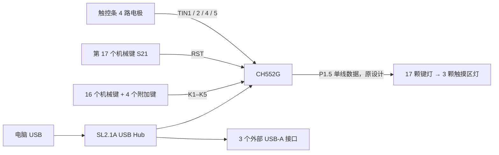

# CH552G 最丐17+4TPRO 驱动分析

分析日期：2026-09-09。依据本目录主板、顶板 SVG 原理图及作者项目说明；尚未烧录测试固件或测量实物波形。

后续固件证据：用户提供的 [丐17Touch_Ver202.hex 解析](firmware/gai17touch-ver202/README.md) 显示四线按键扫描、五路触摸和单路 PWM 灯光，与此处 TPRO 原理图不同。下文仅适用于保存的 TPRO 原理图，不能据此确认用户实物及该 HEX 的驱动接线。

## 结论与硬件范围

这块板可以用 CH552G 同时完成按键扫描、RGB 灯链控制和触控条检测。建议使用独立的精简 C 固件，先验证底层输入与灯光，再接 USB HID 和 Kivo。

本机实际灯光配置已经用户确认：大部分灯珠未焊接，仅背面标记 `L1` 的一颗灯珠可用。驱动以控制这一颗灯为目标。L1 对应的原理图位号、是否存在跳线，以及与 P1.5 的数据连接尚未确认。

原理图的完整配置是 17 个机械键、4 个附加轻触键、20 颗串联 RGB LED，以及 4 通道电容触控条。以下完整灯链用于理解原设计，不代表本机实际装配。

- `S1–S16`：16 个带灯机械键，接 K1–K5 扫描网络。
- `S21`：第 17 个带灯机械键，单独接 RST。
- `S17–S20`：4 个附加轻触键，也接 K1–K5。
- 主板 17 颗键灯 + 顶板 `LED1–LED3` = 20 颗 RGB LED。
- 顶板 H1 引出 4 路触摸信号；SVG 未画电极形状和空间顺序，位置算法还需 PCB 或实测数据。

## 接线与引脚分配

| 功能 | 网络 | CH552G 引脚 | SOP16 脚号 |
|---|---|---|---|
| 按键扫描 | K1 | P3.0 | 8 |
| 按键扫描 | K2 | P3.1 | 7 |
| 按键扫描 | K3 | P3.2 | 1 |
| 按键扫描 | K4 | P3.4 | 11 |
| 按键扫描 | K5 | P3.3 | 10 |
| 独立机械键 S21 | RST | RST 输入 | 6 |
| RGB 灯链起点 | MOSI | P1.5 | 3 |
| 触摸通道 | TIN1 | P1.1 | 9 |
| 触摸通道 | TIN2 | P1.4 | 2 |
| 触摸通道 | TIN4 | P1.6 | 4 |
| 触摸通道 | TIN5 | P1.7 | 5 |
| USB D+ | DP1 | P3.6 / UDP | 12 |
| USB D− | DM1 | P3.7 / UDM | 13 |

H1 的 1–7 脚依次为 TIN2、TIN4、TIN5、GND、TIN1、LED_BUS、+5V。这个顺序是连接器脚序，不是触控条的位置顺序。

HT7533 将 USB +5V 转为 VCC（3.3V），供 CH552G；灯链使用 +5V。首灯由 P1.5 直接驱动，图上未见电平转换器，实际首灯输入高电平容限需按所装 LED 型号核对。



SL2.1A 自行处理 USB Hub 功能，CH552G 是它的一个下游设备。CH552G 固件不负责转发另外三个 USB 口的数据。

## 按键驱动

K1–K5 各有 1 kΩ 上拉到 VCC。网络采用五根线轮流作输出和输入的有向扫描方式，共 5 × 4 = 20 个交叉位置，不是行线与列线分开的常规矩阵。

按图上二极管方向，每轮仅把一根 K 线拉低，另外四根设为输入，由外部电阻上拉；检测读入的低电平。扫描表如下：

| 拉低的线 | 读 K1 | 读 K2 | 读 K3 | 读 K4 | 读 K5 |
|---|---|---|---|---|---|
| K1 | — | S1 | S2 | S3 | S4 |
| K2 | S5 | — | S6 | S7 | S8 |
| K3 | S9 | S10 | — | S11 | S12 |
| K4 | S13 | S14 | S15 | — | S16 |
| K5 | S17 | S18 | S19 | S20 | — |

切换扫描相位前先释放上一根输出线，再拉低下一根。输入线不能配置为推挽输出高电平。只修改 K1–K5 对应的 P3 位，保留 USB 引脚设置。

建议初版约每 1 ms 完成一次五相扫描，逐键采用约 5 ms 稳定消抖；这是待实测调整的目标。多键按下时可能形成跨多个节点的串联导通路径，因此需要验证常用组合、三键组合和松开顺序，不能仅凭每键有二极管便承诺全键无冲。位号到键帽功能的映射仍需实物逐键确认。

### S21 / RST 的特殊处理

S21 按下时将 RST 接到 VCC，属于高电平有效的独立输入。必须在芯片配置中关闭外部复位功能，否则按下会复位 MCU；普通 `pinMode` 不能代替烧录配置。运行时可读取 `CLOCK_CFG & bRST`，其中 `bRST = 0x08`，再执行独立消抖。

来源：[ch55xduino 的 Reset Pins 说明](https://github.com/DeqingSun/ch55xduino#reset-pins)、[芯片寄存器定义](https://github.com/DeqingSun/ch55xduino/blob/ch55xduino/ch55xduino/ch55x/variants/ch552/include/ch5xx.h)。当前设备配置是否已关闭外部复位尚未核实，本次不修改配置。

## RGB 驱动

本机只需控制背面 L1，不能直接将实物丝印 `L1` 等同于顶板原理图的 `LED1`。先确认 L1 的 DIN 接线及上游是否存在有效的数据通路；串联链中未焊接的灯珠不会自动透传 DIN 到 DOUT。

原设计是可寻址单线灯链。按 DIN / DOUT 连线，完整数据顺序为：

```text
P1.5 / MOSI
  → S21 → S16 → S15 → … → S2 → S1
  → LED_BUS / H1.6
  → 顶板 LED1 → LED2 → LED3
```

作者说明明确提到 WS2812 驱动和 20 颗灯；SVG 未提供精确 LED 料号，因此仍需核实颜色字节顺序及复位低电平时间。[作者项目说明](https://oshwhub.com/yangzen/xing-huo-ji-hua-zui-gai-17-4-chu-mo-ji-xie-jian-pan-pro)

初版使用经过 CH552 时钟校准的 GPIO / 汇编单线发送驱动。若确认 L1 是数据链首颗灯，只需 3 字节颜色缓冲区；若它处于仍连通的串联链后方，则需发送到其实际位置，不能仅因可用灯只有一颗就假定其索引为 0。先低亮度验证 RGB 三色，再增加动画。

按常见 800 kbit/s、24 bit/灯计算，单颗灯数据部分约 30 μs，原设计 20 灯约 600 μs，均另加所装灯珠要求的复位间隔；实际发送长度按 L1 的数据链位置确定。建议从 30 Hz 动画和有变化才发送开始。

网络虽叫 MOSI，但不代表应直接初始化标准 SPI：SPI 的 SCK/P1.7 与 TIN5 触摸复用，必须避免初始化时接管触摸引脚。若后续考虑 SPI 编码发送，应先确认 CH552 的引脚复用和发送连续性。

## 触控条驱动

图上没有独立 I²C 触摸控制器；使用 CH552G 内置电容触摸模块。只启用 TIN1、TIN2、TIN4、TIN5，关闭这些引脚的数字上拉及输出驱动。若采用 ch55xduino TouchKey 的通道位掩码，其值为 `0x36`，不包含承担灯链输出的 TIN3/P1.5。

建议处理链路：

```text
轮询四个触摸通道
  → 保存原始值、基线、触摸增量
  → 噪声过滤与按下/松开阈值滞回
  → 单指位置估计
  → 点击、长按、滑动事件
  → 音量 / 滚轮 / Kivo 动作
```

ch55xduino TouchKey 实现提供原始值采样和自适应基线，使用基线减原始值判断触摸，可作为底层参考；仅获取四个按下位不足以实现平滑位置估计。[TouchKey 实现](https://github.com/DeqingSun/ch55xduino/blob/ch55xduino/ch55xduino/ch55x/libraries/TouchKey/src/TouchKey.c)

先输出四通道原始值，按实际电极布局校准方向、增益和坐标。对线性排列且响应适合插值的电极，可使用 `position = sum(delta[i] * coordinate[i]) / sum(delta[i])`；该公式是候选方案，不能从连接器脚序直接得到坐标。用整数运算，并在总信号低于阈值时输出无触摸；触摸期间不要让基线追踪吞掉长按。

初版先做可靠的单指点击与滑动。双指手势需要原作者算法或更多实测数据，不能把四通道直接当成通用多点触控屏。触控完整帧可从 60–100 Hz 的目标范围调试，最终以信噪比和与 USB/RGB 并发的稳定性决定。

## 并发与 USB

作者记录过灯光接收和触摸模块同时运行时某 USB 端点卡死，以及通过错开触摸与灯光工作缓解的情况。这是原固件报告的现象，不足以断言是芯片硬件缺陷。[作者项目说明](https://oshwhub.com/yangzen/xing-huo-ji-hua-zui-gai-17-4-chu-mo-ji-xie-jian-pan-pro)

建议由主循环统一调度：USB 中断仅接收短数据或置标志；触摸中断仅保存采样；按键消抖、位置计算、手势和灯效都在主循环处理。RGB 帧发送与触摸采样错开，发送结束恢复采样。若单线时序要求短暂屏蔽 USB 中断，需要按实际发送长度评估影响，避免在 USB ISR 内阻塞发送整帧灯光。单颗灯所需时间明显短于完整灯链，但并发稳定性仍需验证。

USB 首版可提供键盘、多媒体键、鼠标滚轮 HID 报告；调试接口输出原始按键位图与触摸值。接入 Kivo 时再评估 Vendor HID 或 CDC 的配置/事件通道，不能在未预算端点内存和代码体积前同时堆入全部接口。固件按事件上报，完整 Flash/RAM 占用须看实际链接结果。

## Kivo 接入建议

当前仓库支持 ESP32-S3 / RP2040；通用固件依赖 C++ 容器、可选值和动态拓扑。现有 `MatrixInputSource` 定义独立的 rows / columns，这块板的共享引脚五相扫描需要专用处理：

- [当前支持控制器](../README.md)
- [输入拓扑定义](../lib/gpio_trigger/src/InputTopology.h)
- [平台接口](../firmware/src/platform/Platform.h)

建议先建立独立 CH552G 固件目标，使用 C + SDCC，固定这块板的引脚和静态缓冲区；ch55xduino 可帮助验证外设。把板级扫描统一输出为逻辑按键编号，让桌面端承担复杂动作和配置解释。后续正式接入时再增加 Controller Family、Board Profile、设备识别和上传流程，并明确它支持的协议能力。现有 C++ 固件不能靠增加一份引脚 YAML 就在 CH552G 上运行。

作者页面有 `17键RGB键盘程序Ver1.93.zip` 源码附件和更新的 HEX，原源码值得优先参考扫描与触摸实现；本次未下载、审查或编译该附件，不能把源码版本当成最新发布固件。

## 建议验证顺序

1. 逐键读取原始输入，确认 S1–S16、S21 和实物是否存在 S17–S20；单独确认 S21 不触发复位。
2. 确认背面 L1 的原理图对应关系和 DIN 通路，低亮度验证其数据位置、颜色顺序及通信。
3. 输出四路触摸原始值，确认位置顺序、无触摸噪声、长按漂移和单指滑动。
4. 合并驱动，持续测试按键 + 滑动 + RGB 更新 + USB 配置收发，观察掉线、丢释放和端点停滞。
5. 验证重插、休眠唤醒及常用多键组合，再接入 Kivo 动作。

以上为驱动方案和验收项目，不是已完成的设备测试。
